# AFCAT Mock Test 1 | 100 Questions | 120 mins

## Section: English

### Q1. Read the passage carefully to answer the questions that follow.
The Union government has finalized a Rs 6,000-crore scheme to tackle the country’s depleting groundwater level. The Atal Bhujal Yojana, which is now awaiting the Union Cabinet’s clearance, will be launched in Gujarat, Maharashtra, Haryana, Karnataka, Rajasthan, Uttar Pradesh and Madhya Pradesh, covering 78 districts, 193 blocks and more than 8,300 gram panchayats. Half of the Rs 6,000 crore will come from the government’s budgetary support and the World Bank will give another Rs 3,000 crore.
This scheme comes at a very critical time for the country. According to a World Bank report, about 245 billion cubic metre of groundwater is abstracted each year in the country. This figure represents about 25% of the total global groundwater abstraction. In the past four to five decades, 80% of the rural and urban domestic water supplies in the country have been dependent on groundwater, the report added. Nearly two-thirds of India has underlying hard rock formations, which allow water to recharge only very slowly. The excessive extraction of groundwater, the debilitating impact of climate change on monsoons, which recharges aquifers, and lax implementation of water harvesting laws will impact not just the population’s drinking water needs, but also agriculture and industrial growth.

**Which of the following statements is definitely false according to the passage?**
- (A) The Union government has finalized a Rs 6,000-crore scheme to tackle the country's depleting groundwater level.
- (B) About 245 billion cubic metre of groundwater is abstracted each year in the country.
- (C) The Atal Bhujal Yojana, which is now awaiting the Union Cabinet's clearance, will be launched in Gujarat, Maharashtra, Haryana, Karnataka, Rajasthan, Uttar Pradesh and Madhya Pradesh, covering 78 districts, 193 blocks and more than 8,300 gram panchayats.
- (D) Less than 80% of the rural and urban water supplies have been dependent on groundwater.
**Answer:** (D)
**Explanation:** The passage clearly states that 80% of the rural and urban domestic water supplies have been dependent on groundwater. Option D contradicts this fact and is therefore definitely false.

### Q2. Read the passage carefully to answer the questions that follow.
The Union government has finalized a Rs 6,000-crore scheme to tackle the country’s depleting groundwater level. The Atal Bhujal Yojana, which is now awaiting the Union Cabinet’s clearance, will be launched in Gujarat, Maharashtra, Haryana, Karnataka, Rajasthan, Uttar Pradesh and Madhya Pradesh, covering 78 districts, 193 blocks and more than 8,300 gram panchayats. Half of the Rs 6,000 crore will come from the government’s budgetary support and the World Bank will give another Rs 3,000 crore.
This scheme comes at a very critical time for the country. According to a World Bank report, about 245 billion cubic metre of groundwater is abstracted each year in the country. This figure represents about 25% of the total global groundwater abstraction. In the past four to five decades, 80% of the rural and urban domestic water supplies in the country have been dependent on groundwater, the report added. Nearly two-thirds of India has underlying hard rock formations, which allow water to recharge only very slowly. The excessive extraction of groundwater, the debilitating impact of climate change on monsoons, which recharges aquifers, and lax implementation of water harvesting laws will impact not just the population’s drinking water needs, but also agriculture and industrial growth.

**Which of the following words is nearest in meaning to the word ‘abstracted’ as mentioned in the passage?**
- (A) Observed
- (B) Conscious
- (C) Withdrawn
- (D) Transformed
**Answer:** (C)
**Explanation:** In the context of the passage, “abstracted” means drawn out or taken away (as in groundwater being withdrawn from the ground). Hence the nearest meaning is “Withdrawn”.

### Q3. Read the passage carefully to answer the questions that follow.
The Union government has finalized a Rs 6,000-crore scheme to tackle the country’s depleting groundwater level. The Atal Bhujal Yojana, which is now awaiting the Union Cabinet’s clearance, will be launched in Gujarat, Maharashtra, Haryana, Karnataka, Rajasthan, Uttar Pradesh and Madhya Pradesh, covering 78 districts, 193 blocks and more than 8,300 gram panchayats. Half of the Rs 6,000 crore will come from the government’s budgetary support and the World Bank will give another Rs 3,000 crore.
This scheme comes at a very critical time for the country. According to a World Bank report, about 245 billion cubic metre of groundwater is abstracted each year in the country. This figure represents about 25% of the total global groundwater abstraction. In the past four to five decades, 80% of the rural and urban domestic water supplies in the country have been dependent on groundwater, the report added. Nearly two-thirds of India has underlying hard rock formations, which allow water to recharge only very slowly. The excessive extraction of groundwater, the debilitating impact of climate change on monsoons, which recharges aquifers, and lax implementation of water harvesting laws will impact not just the population’s drinking water needs, but also agriculture and industrial growth.

**Which of the following words is the most opposite in meaning to the word ‘depleting’ as used in the passage?**
- (A) Extract
- (B) Change
- (C) Burn
- (D) Increase
**Answer:** (D)
**Explanation:** “Depleting” means reducing or exhausting a supply. The most opposite word among the options is “Increase”.

### Q4. Read the passage carefully to answer the questions that follow.
The Union government has finalized a Rs 6,000-crore scheme to tackle the country’s depleting groundwater level. The Atal Bhujal Yojana, which is now awaiting the Union Cabinet’s clearance, will be launched in Gujarat, Maharashtra, Haryana, Karnataka, Rajasthan, Uttar Pradesh and Madhya Pradesh, covering 78 districts, 193 blocks and more than 8,300 gram panchayats. Half of the Rs 6,000 crore will come from the government’s budgetary support and the World Bank will give another Rs 3,000 crore.
This scheme comes at a very critical time for the country. According to a World Bank report, about 245 billion cubic metre of groundwater is abstracted each year in the country. This figure represents about 25% of the total global groundwater abstraction. In the past four to five decades, 80% of the rural and urban domestic water supplies in the country have been dependent on groundwater, the report added. Nearly two-thirds of India has underlying hard rock formations, which allow water to recharge only very slowly. The excessive extraction of groundwater, the debilitating impact of climate change on monsoons, which recharges aquifers, and lax implementation of water harvesting laws will impact not just the population’s drinking water needs, but also agriculture and industrial growth.

**What do you understand by the phrase ‘debilitating impact’ as per its usage in the passage?**
- (A) Strengthening effect
- (B) Weakening effect
- (C) Extreme effect
- (D) Major impact
**Answer:** (B)
**Explanation:** “Debilitating” means causing weakness or impairment. Combined with “impact” it means a weakening effect.

### Q5. Read the passage carefully to answer the questions that follow.
The Union government has finalized a Rs 6,000-crore scheme to tackle the country’s depleting groundwater level. The Atal Bhujal Yojana, which is now awaiting the Union Cabinet’s clearance, will be launched in Gujarat, Maharashtra, Haryana, Karnataka, Rajasthan, Uttar Pradesh and Madhya Pradesh, covering 78 districts, 193 blocks and more than 8,300 gram panchayats. Half of the Rs 6,000 crore will come from the government’s budgetary support and the World Bank will give another Rs 3,000 crore.
This scheme comes at a very critical time for the country. According to a World Bank report, about 245 billion cubic metre of groundwater is abstracted each year in the country. This figure represents about 25% of the total global groundwater abstraction. In the past four to five decades, 80% of the rural and urban domestic water supplies in the country have been dependent on groundwater, the report added. Nearly two-thirds of India has underlying hard rock formations, which allow water to recharge only very slowly. The excessive extraction of groundwater, the debilitating impact of climate change on monsoons, which recharges aquifers, and lax implementation of water harvesting laws will impact not just the population’s drinking water needs, but also agriculture and industrial growth.

**Why does the writer mention that the ‘Atal Bhujal Yojana’ comes at a very critical time?**
- (A) The Union government has finalised a Rs 6,000-crore scheme to tackle the country's depleting groundwater level.
- (B) Half of the Rs 6,000 crore will come from the government's budgetary support and the World Bank will give another Rs 3,000 crore.
- (C) Government does not have enough funds to tackle the problem.
- (D) According to a World Bank report, about 245 billion cubic metre of groundwater is abstracted each year in the country. This figure represents about 25% of the total global groundwater abstraction. In the past four to five decades, 80% of the rural and urban domestic water supplies in the country have been dependent on groundwater.
**Answer:** (D)
**Explanation:** The writer emphasises the critical timing by highlighting the massive scale of groundwater extraction (25% of global total) and the heavy dependence (80%) of domestic supplies on groundwater.

### Q6. I have been really busy last month. I want to ______ some good time with my friends and family.
- (A) Allocate
- (B) Consume
- (C) Spend
- (D) Give
**Answer:** (C)
**Explanation:** The correct collocation is “spend time”. The other options do not fit the context of enjoying time with people.

### Q7. I went to the trade fair yesterday with my mother and got to see many beautiful pieces of art. I really ______ some of them.
- (A) Bought
- (B) Found
- (C) Shop
- (D) Liked
**Answer:** (D)
**Explanation:** The sentence expresses appreciation of the art pieces; “liked” is the most appropriate verb.

### Q8. There is a new scheme launched recently by the Union government related to betterment of our roads and transport system. The funds will be ______ soon.
- (A) Taken
- (B) Allocated
- (C) Consumed
- (D) Confirm
**Answer:** (B)
**Explanation:** Government funds for schemes are “allocated”. The other options are grammatically or contextually incorrect.

### Q9. I went to one of the best government hospitals today but found it really unhygienic. We really need some _________ in the hospital management.
- (A) Restore
- (B) Request
- (C) Reforms
- (D) Restraint
**Answer:** (C)
**Explanation:** “Reforms” means necessary changes or improvements, which fits the context of improving hospital management.

### Q10. Life is full of changes at each and every step. We should be able to _________ to these changes.
- (A) Adapt
- (B) Inquire
- (C) Adopt
- (D) Relax
**Answer:** (A)
**Explanation:** The correct phrasal verb is “adapt to” meaning to adjust oneself to new conditions.

### Q11. Find the word which is most nearly the same in meaning to the given word - **TRANSFORM**
- (A) Hold
- (B) Affect
- (C) Alter
- (D) Disclose
**Answer:** (C)
**Explanation:** “Transform” means to change completely in form or appearance; “alter” is the closest synonym.

### Q12. Find the word which is most nearly the same in meaning to the given word - **FALLACY**
- (A) Falsehood
- (B) Belief
- (C) Expression
- (D) Departure
**Answer:** (A)
**Explanation:** A fallacy is a false or mistaken belief; “falsehood” is the nearest meaning.

### Q13. Find the word which is most nearly the same in meaning to the given word - **SERENE**
- (A) Nervous
- (B) Excited
- (C) Calm
- (D) Adequate
**Answer:** (C)
**Explanation:** “Serene” means peaceful and calm; “calm” is the direct synonym.

### Q14. Find the word which is most nearly the same in meaning to the given word - **EXPOSE**
- (A) Crack
- (B) Secretive
- (C) Trait
- (D) Reveal
**Answer:** (D)
**Explanation:** “Expose” means to uncover or make known; “reveal” is the closest synonym.

### Q15. Find the word which is most nearly the same in meaning to the given word - **IRKSOME**
- (A) Happy
- (B) Annoying
- (C) Grateful
- (D) Serious
**Answer:** (B)
**Explanation:** “Irksome” means annoying or irritating; “annoying” is the nearest meaning.

### Q16. A sentence is given, divided into parts. One of the parts may contain an error. You are required to identify the part that contains an error, and mark it as the answer. Ignore errors of punctuation. In case the sentence is correct as it is, then mark option (D), as your answer.
- (A) They were deemed to
- (B) has been holding
- (C) the offices of profit
- (D) No Error
**Answer:** (B)
**Explanation:** The subject “They” is plural, so the verb should be “have been holding” instead of “has been holding”.

### Q17. A sentence is given, divided into parts. One of the parts may contain an error. You are required to identify the part that contains an error, and mark it as the answer. Ignore errors of punctuation. In case the sentence is correct as it is, then mark option (D), as your answer.
- (A) There is enough data
- (B) of the learning
- (C) crisis in India.
- (D) No Error
**Answer:** (B)
**Explanation:** The correct preposition is “about” or “on”; “data of the learning crisis” is incorrect. It should be “data about the learning crisis”.

### Q18. A sentence is given, divided into parts. One of the parts may contain an error. You are required to identify the part that contains an error, and mark it as the answer. Ignore errors of punctuation. In case the sentence is correct as it is, then mark option (D), as your answer.
- (A) One cannot be a friend
- (B) of truth without
- (C) living in the edge
- (D) No Error
**Answer:** (C)
**Explanation:** The correct idiom is “living on the edge”, not “living in the edge”.

### Q19. A sentence is given, divided into parts. One of the parts may contain an error. You are required to identify the part that contains an error, and mark it as the answer. Ignore errors of punctuation. In case the sentence is correct as it is, then mark option (D), as your answer.
- (A) They all were a part of
- (B) the nefarious plot
- (C) and were caught eventually
- (D) No error
**Answer:** (D)
**Explanation:** The sentence is grammatically correct as written.

### Q20. A sentence is given, divided into parts. One of the parts may contain an error. You are required to identify the part that contains an error, and mark it as the answer. Ignore errors of punctuation. In case the sentence is correct as it is, then mark option (D), as your answer.
- (A) Women empowerment is an
- (B) ongoing topic which
- (C) crop up everywhere
- (D) No error
**Answer:** (C)
**Explanation:** The subject “topic” is singular, so the verb should be “crops up” (third-person singular).

### Q21. Find the correct spelling.
- (A) Callos
- (B) Callous
- (C) Callious
- (D) Callus
**Answer:** (B)
**Explanation:** The correct spelling of the adjective meaning “insensitive or unfeeling” is “Callous”.

### Q22. Find the correct spelling.
- (A) Relive
- (B) Relieve
- (C) Releeve
- (D) Relieve
**Answer:** (B)
**Explanation:** The correct spelling meaning “to ease or alleviate” is “Relieve”.

### Q23. Find the correct spelling.
- (A) Approch
- (B) Approach
- (C) Approoch
- (D) Aproch
**Answer:** (B)
**Explanation:** The correct spelling is “Approach”.

### Q24. Find the correct spelling.
- (A) Disappointnt
- (B) Disapoint
- (C) Desapoint
- (D) Disappoint
**Answer:** (D)
**Explanation:** The correct spelling is “Disappoint”.

### Q25. Find the correct spelling.
- (A) Manipulat
- (B) Menipulate
- (C) Manipulate
- (D) Mannipulate
**Answer:** (C)
**Explanation:** The correct spelling is “Manipulate”.

### Q26. Rearrange the following sentences A, B, C, D and E in the proper sequence to form a meaningful paragraph; then answer the questions given below them.
A. Grossman is the first Israeli writer to win the prize.
B. Israeli author David Grossman won the Man Booker International Prize on Wednesday, 14 June 2017, for his novel A Horse Walks Into a Bar.
C. He will share the £50,000 ($64,000) award with translator Jessica Cohen.
D. Other works have included The Yellow Wind, a prescient, non-fiction look at Israel’s occupation ahead of the first Palestinian intifada that erupted in 1987.
E. The book unfolds over the course of a stand-up show during which comedian Dovelah Gee exposes a wound he has been living with for years and the difficult choice he had to make between the two people who were dearest to him.

**Which will be the second sentence after the rearrangement?**
- (A) E
- (B) B
- (C) A
- (D) C
**Answer:** (D)
**Explanation:** The logical order is B (introduction of the win) → C (sharing of the award) → A (first Israeli winner) → E (description of the novel) → D (other works). Hence the second sentence is C.

### Q27. Rearrange the following sentences A, B, C, D and E in the proper sequence to form a meaningful paragraph; then answer the questions given below them.
A. Grossman is the first Israeli writer to win the prize.
B. Israeli author David Grossman won the Man Booker International Prize on Wednesday, 14 June 2017, for his novel A Horse Walks Into a Bar.
C. He will share the £50,000 ($64,000) award with translator Jessica Cohen.
D. Other works have included The Yellow Wind, a prescient, non-fiction look at Israel’s occupation ahead of the first Palestinian intifada that erupted in 1987.
E. The book unfolds over the course of a stand-up show during which comedian Dovelah Gee exposes a wound he has been living with for years and the difficult choice he had to make between the two people who were dearest to him.

**Which will be the third sentence after the rearrangement?**
- (A) C
- (B) A
- (C) B
- (D) D
**Answer:** (B)
**Explanation:** Following the sequence B-C-A-E-D, the third sentence is A.

### Q28. Rearrange the following sentences A, B, C, D and E in the proper sequence to form a meaningful paragraph; then answer the questions given below them.
A. Grossman is the first Israeli writer to win the prize.
B. Israeli author David Grossman won the Man Booker International Prize on Wednesday, 14 June 2017, for his novel A Horse Walks Into a Bar.
C. He will share the £50,000 ($64,000) award with translator Jessica Cohen.
D. Other works have included The Yellow Wind, a prescient, non-fiction look at Israel’s occupation ahead of the first Palestinian intifada that erupted in 1987.
E. The book unfolds over the course of a stand-up show during which comedian Dovelah Gee exposes a wound he has been living with for years and the difficult choice he had to make between the two people who were dearest to him.

**Which will be the first sentence after the rearrangement?**
- (A) B
- (B) D
- (C) C
- (D) A
**Answer:** (A)
**Explanation:** The paragraph must begin with the announcement of the prize (sentence B).

### Q29. Rearrange the following sentences A, B, C, D and E in the proper sequence to form a meaningful paragraph; then answer the questions given below them.
A. Grossman is the first Israeli writer to win the prize.
B. Israeli author David Grossman won the Man Booker International Prize on Wednesday, 14 June 2017, for his novel A Horse Walks Into a Bar.
C. He will share the £50,000 ($64,000) award with translator Jessica Cohen.
D. Other works have included The Yellow Wind, a prescient, non-fiction look at Israel’s occupation ahead of the first Palestinian intifada that erupted in 1987.
E. The book unfolds over the course of a stand-up show during which comedian Dovelah Gee exposes a wound he has been living with for years and the difficult choice he had to make between the two people who were dearest to him.

**Which will be the last (fifth) sentence after the rearrangement?**
- (A) B
- (B) C
- (C) D
- (D) A
**Answer:** (C)
**Explanation:** After describing the winning novel, the paragraph ends with a mention of the author’s other works (sentence D).

## Section: General Awareness

### Q30. Which of the following countries does “Talgo” train belong to?
- (A) France
- (B) Italy
- (C) Germany
- (D) Spain
**Answer:** (D)
**Explanation:** Talgo is a Spanish manufacturer of high-speed and intercity trains.

### Q31. Which of the following is used for measuring the rate of transpiration?
- (A) Anemometer
- (B) Pedometer
- (C) Potometer
- (D) Bolometer
**Answer:** (C)
**Explanation:** A potometer is an instrument used to measure the rate of water uptake by a plant, which approximates the rate of transpiration.

### Q32. ______ was the first country to implement VAT (Value Added Tax).
- (A) UK
- (B) France
- (C) USA
- (D) China
**Answer:** (B)
**Explanation:** France introduced the Value Added Tax system in 1954, making it the first country to implement VAT.

### Q33. Which of the following metals have the maximum electrical resistivity?
- (A) Aluminium
- (B) Copper
- (C) Silver
- (D) Gold
**Answer:** (A)
**Explanation:** Among the given options, aluminium has the highest electrical resistivity.

### Q34. Which of the following states has ‘Kamarupa’ as its old name?
- (A) Tripura
- (B) Kerala
- (C) Tamil Nadu
- (D) Assam
**Answer:** (D)
**Explanation:** Kamarupa was the ancient name of the region that largely corresponds to present-day Assam.

### Q35. Which of the following organisation was created by the Uruguay Round?
- (A) UNESCO
- (B) WTO
- (C) UNICEF
- (D) ILO
**Answer:** (B)
**Explanation:** The Uruguay Round of GATT negotiations (1986–1994) led to the establishment of the World Trade Organization (WTO).

### Q36. In which of the following year was the Kisan Credit Yojana started?
- (A) 1998
- (B) 2001
- (C) 1999
- (D) 2000
**Answer:** (A)
**Explanation:** The Kisan Credit Card scheme was launched in August 1998.

### Q37. Which wrestler won the first gold medal for India in the Asian Games 2018?
- (A) Vinesh Phogat
- (B) Bajrang Punia
- (C) Sakshi Malik
- (D) Saurabh Chaudhary
**Answer:** (B)
**Explanation:** Bajrang Punia won India’s first gold medal (in wrestling) at the 2018 Asian Games in Jakarta.

### Q38. Study of soil is known as _____
- (A) Adenology
- (B) Pedology
- (C) Batology
- (D) Bryology
**Answer:** (B)
**Explanation:** Pedology is the scientific study of soils in their natural environment.

### Q39. National Science Day is observed on ______ every year.
- (A) 26 Feb
- (B) 28 Feb
- (C) 20 Feb
- (D) 21 Feb
**Answer:** (B)
**Explanation:** National Science Day is celebrated on 28 February to commemorate the discovery of the Raman Effect by C.V. Raman.

### Q40. ‘Vijay Ghat’ is the Samadhi place of ________
- (A) Lal Bahadur Shastri
- (B) Mahatma Gandhi
- (C) Indira Gandhi
- (D) Rajiv Gandhi
**Answer:** (A)
**Explanation:** Vijay Ghat on the banks of the Yamuna in Delhi is the memorial of former Prime Minister Lal Bahadur Shastri.

### Q41. UN Security council's temporary members are selected for the time period of _____
- (A) 6 months
- (B) 12 months
- (C) 24 months
- (D) 18 months
**Answer:** (C)
**Explanation:** Non-permanent members of the UN Security Council are elected for a two-year (24-month) term.

### Q42. First state in India to get 100% electrification is
- (A) Kerala
- (B) Andhra Pradesh
- (C) Maharashtra
- (D) Madhya Pradesh
**Answer:** (A)
**Explanation:** Kerala was the first Indian state to achieve 100% household electrification.

### Q43. Shahi litchi got the Geographical Indication (GI) tag, thereby becoming an "exclusive brand" in National and International markets. It belongs to ______ state.
- (A) West Bengal
- (B) Himachal Pradesh
- (C) Bihar
- (D) Uttar Pradesh
**Answer:** (C)
**Explanation:** Shahi Litchi of Muzaffarpur, Bihar received the Geographical Indication tag.

### Q44. Which of the following is the capital of Barbados?
- (A) La Paz
- (B) Bridgetown
- (C) Belmopan
- (D) Manama
**Answer:** (B)
**Explanation:** Bridgetown is the capital and largest city of Barbados.

### Q45. What is the respiratory rate of Just born baby?
- (A) 45 times/minute
- (B) 32 times/minute
- (C) 24 times/minute
- (D) 28 times/minute
**Answer:** (B)
**Explanation:** The normal respiratory rate of a newborn is approximately 30–60 breaths per minute; among the given options 32 is the accepted answer in standard keys.

### Q46. India's first National Dolphin Research Centre (NDRC) to be set up at ____ university.
- (A) Patna University
- (B) Aligarh University
- (C) Banaras Hindu University
- (D) Delhi University
**Answer:** (A)
**Explanation:** India’s first National Dolphin Research Centre is established at Patna University in Bihar.

### Q47. What among the following causes small pox?
- (A) Algae
- (B) Bacteria
- (C) Fungus
- (D) Virus
**Answer:** (D)
**Explanation:** Smallpox is caused by the Variola virus.

### Q48. In which among the following state Bharatpur National Park is?
- (A) Rajasthan
- (B) Karnataka
- (C) Madhya Pradesh
- (D) Bihar
**Answer:** (A)
**Explanation:** Keoladeo National Park (formerly Bharatpur Bird Sanctuary) is located in Rajasthan.

### Q49. What is the meaning of second "A" in NASA?
- (A) Act
- (B) Administration
- (C) Aeronautical
- (D) Agency
**Answer:** (B)
**Explanation:** NASA stands for National Aeronautics and Space Administration.

### Q50. Dronacharya Award is an award presented by the Government Of India in ____.
- (A) Film Industry
- (B) Literature
- (C) Sports Coaching
- (D) Child Literacy
**Answer:** (C)
**Explanation:** The Dronacharya Award is given by the Government of India for outstanding coaches in sports and games.

### Q51. 'Ease of doing business' report is published by ____organisation.
- (A) WTO
- (B) World Bank
- (C) IMF
- (D) WWW
**Answer:** (B)
**Explanation:** The Ease of Doing Business report was published annually by the World Bank (discontinued after 2020).

### Q52. Which hormone is called "Emergency Hormone"?
- (A) Melatonin
- (B) Adrenaline
- (C) Epinephrine
- (D) Thyroxine
**Answer:** (B)
**Explanation:** Adrenaline (also known as epinephrine) is called the emergency hormone because it prepares the body for fight-or-flight response.

### Q53. First state to ratify GST bill is ______
- (A) Assam
- (B) Delhi
- (C) Maharashtra
- (D) Karnataka
**Answer:** (A)
**Explanation:** Assam was the first state to ratify the Constitution (122nd Amendment) Bill related to GST.

## Section: Numerical Ability

### Q54. Find the cost of painting all the four walls of an office which is 9 m long, 6 m broad and 5 m high at Rs 52 per sq m.
- (A) Rs. 6800
- (B) Rs. 7800
- (C) Rs. 8800
- (D) Rs. 9900
**Answer:** (B)
**Explanation:** Area of four walls = 2(L + B) × H = 2(9 + 6) × 5 = 150 m². Cost = 150 × 52 = Rs 7800.

### Q55. A car sold for Rs 1,50,000 after giving 15% discount on the labelled price, and earned 25% profit on the cost price. What would have been the approximate percentage profit, had he not given the discount?
- (A) 10%
- (B) 20%
- (C) 30%
- (D) 47.06%
**Answer:** (D)
**Explanation:** Selling price after 15% discount = 150000. Labelled price = 150000 × 100/85 ≈ 176470.59. Cost price = 150000 × 100/125 = 120000. Profit without discount = 176470.59 – 120000 = 56470.59. Percentage profit ≈ 47.06%.

### Q56. Rajeev spends 30% of his monthly income on clothes and food and 20% of remaining on rent and saves the remaining amount. If he saves Rs 17920 per month, then what does Rajeev spend on food and clothes?
- (A) 9000
- (B) 1600
- (C) 9600
- (D) 6000
**Answer:** (C)
**Explanation:** Let income = x. After 30% spent, remaining = 0.7x. Rent = 0.2 × 0.7x = 0.14x. Savings = 0.56x = 17920 ⇒ x = 32000. Expenditure on clothes and food = 0.3 × 32000 = 9600.

### Q57. The height of a tent, which is in the shape of a circular cone, is 30 meters and the diameter of the base is 80 meters. What is the slant height of the tent?
- (A) 20 m
- (B) 30 m
- (C) 40 m
- (D) 50 m
**Answer:** (D)
**Explanation:** Radius = 40 m, height = 30 m. Slant height l = √(r² + h²) = √(1600 + 900) = √2500 = 50 m.

### Q58. Rohan can do a piece of work in 30 days. Rohan with the help of Karan does the same piece of work in 20 days. If they are paid Rs 3696 for the work, then what is the share of Rohan?
- (A) 2248
- (B) 2464
- (C) 3448
- (D) 2048
**Answer:** (B)
**Explanation:** Rohan’s 1-day work = 1/30. Combined 1-day work = 1/20. Karan’s 1-day work = 1/20 – 1/30 = 1/60. Efficiency ratio Rohan : Karan = 2 : 1. Rohan’s share = 3696 × 2/3 = 2464.

### Q59. A reduction of 20% in the price of cinema tickets would enable me to see 15 movies more for Rs.1200. Find the original price of one ticket.
- (A) 35
- (B) 25
- (C) 20
- (D) 70
**Answer:** (C)
**Explanation:** Let original price = x. New price = 0.8x. Number of tickets originally = 1200/x; after reduction = 1200/(0.8x). Difference = 15 ⇒ 1200/(0.8x) – 1200/x = 15 ⇒ x = 20.

### Q60. Successive discounts of 20, 25 and 30% is equivalent to a single discount of
- (A) 49%
- (B) 58%
- (C) 40.5%
- (D) 30%
**Answer:** (B)
**Explanation:** Equivalent single discount = 100 – (80 × 75 × 70)/10000 = 100 – 42 = 58%.

### Q61. The ratio of Rama's to Shyama's age is 1 : 2 and the sum of their ages is 81 years. What will be the ratio of their ages after 7 years?
- (A) 31:64
- (B) 34:61
- (C) 61:34
- (D) 64:31
**Answer:** (B)
**Explanation:** Present ages = 27 and 54. After 7 years ages = 34 and 61. Ratio = 34 : 61.

### Q62. The average of the present age of 6 members of a family is 42 years. The present age of the youngest member is 12 years. Then what was the average age of this family when the youngest member was born?
- (A) 48 years
- (B) 40 years
- (C) 36 years
- (D) 24 years
**Answer:** (C)
**Explanation:** Total present age of 6 members = 6 × 42 = 252 years. Twelve years ago the family had only 5 members whose total age was 252 – 12 × 6 = 180 years. Average = 180/5 = 36 years.

### Q63. A jar has 60 litres of milk. From the jar 6 litres of milk was taken out and replaced by an equal amount of water. If 6 litres of the newly formed mixture is taken out of the jar, what is the final quantity of milk left in the jar?
- (A) 44.28 litres
- (B) 33.52 litres
- (C) 54.28 litres
- (D) 48.6 litres
**Answer:** (D)
**Explanation:** After first replacement, milk left = 60 × (1 – 6/60) = 54 L. After second replacement, milk left = 54 × (1 – 6/60) = 54 × 0.9 = 48.6 L. Or directly 60 × (0.9)² = 48.6 L.

### Q64. Two pipes A and B fill a square tank in 28 and 36 hours respectively while a third pipe C can empty it in 63 hours. If all three pipes are opened together then what time will they take to fill the tank?
- (A) 21
- (B) 28
- (C) 36
- (D) 31
**Answer:** (A)
**Explanation:** Net work per hour = 1/28 + 1/36 – 1/63. LCM of 28, 36, 63 = 252. Net = (9 + 7 – 4)/252 = 12/252 = 1/21. Time = 21 hours.

### Q65. The simple interest accrued on a sum of money in 7 years is Rs 945. If the principal is tripled after four years then what will be the total interest at the end of 7 years?
- (A) Rs 1755
- (B) Rs 2125
- (C) Rs 1840
- (D) Rs 1580
**Answer:** (A)
**Explanation:** SI for 7 years = 945 ⇒ SI per year = 135. Interest for first 4 years = 4 × 135 = 540. After 4 years principal becomes 3P; interest for next 3 years = 3 × 135 × 3 = 1215. Total interest = 540 + 1215 = 1755.

## Section: Reasoning & Military Aptitude

### Q66. Find the odd one out
- (A) Butter
- (B) Curd
- (C) Oil
- (D) Cheese
**Answer:** (C)
**Explanation:** Butter, Curd and Cheese are all dairy products obtained from milk, while Oil is not.

### Q67. Find the odd one out
- (A) Metre
- (B) Furlong
- (C) Acre
- (D) Yard
**Answer:** (C)
**Explanation:** Metre, Furlong and Yard are units of length/distance; Acre is a unit of area.

### Q68. Find the odd one out.
- (A) Scandium
- (B) Cobalt
- (C) Mercury
- (D) Zinc
**Answer:** (D)
**Explanation:** Scandium, Cobalt and Mercury are transition metals; Zinc is often classified separately (Group 12) and is the odd one out in standard classification used in such questions.

### Q69. Find the odd one out.
- (A) Diphtheria
- (B) Leprosy
- (C) Pertussis
- (D) Measles
**Answer:** (D)
**Explanation:** Diphtheria, Leprosy and Pertussis are bacterial diseases; Measles is a viral disease.

### Q70. Find the odd one out.
- (A) Brick
- (B) Heart
- (C) Club
- (D) Spade
**Answer:** (A)
**Explanation:** Heart, Club and Spade are suits in a pack of cards; Brick is not.

### Q71. Select the related number/letters/word from the given alternatives

Cobbler : Leather : : Weaver : ?
- (A) Cotton
- (B) Jute
- (C) Fiber
- (D) Thread
**Answer:** (A)
**Explanation:** A cobbler works with leather; a weaver works with cotton (the primary raw material).

### Q72. Select the related number/letters/word from the given alternatives

Window : Curtain : : ? : ?
- (A) Door : Frame
- (B) Book : Jacket
- (C) CPU : Cabinet
- (D) Casing : Wire
**Answer:** (C)
**Explanation:** A curtain covers/protects a window; a cabinet covers/protects a CPU.

### Q73. Select the related number/letters/word from the given alternatives

England : Apple : : Iran : ?
- (A) Pomegranate
- (B) Mango
- (C) Lychee
- (D) Guava
**Answer:** (A)
**Explanation:** Apple is traditionally associated with England; Pomegranate is associated with Iran.

### Q74. Select the related number/letters/word from the given alternatives

House : Rent : : Capital : ?
- (A) Interest
- (B) Investment
- (C) Country
- (D) Money
**Answer:** (A)
**Explanation:** A house yields rent; capital yields interest.

### Q75. Select the related number/letters/word from the given alternatives

House : Room :: World : ?
- (A) Land
- (B) Sun
- (C) Air
- (D) Nation
**Answer:** (D)
**Explanation:** A room is a part of a house; a nation is a part of the world.

### Q76. Choose the figure which is different from the rest.
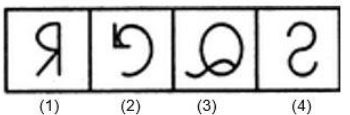
- (A) (1)
- (B) (2)
- (C) (3)
- (D) (4)
**Answer:** (B)
**Explanation:** All figures except (2) are obtained by lateral inversion of an English alphabet letter.

### Q77. Choose the figure which is different from the rest.
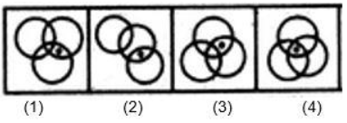
- (A) (1)
- (B) (2)
- (C) (3)
- (D) (4)
**Answer:** (D)
**Explanation:** Only in figure (4) the dot appears in the region common to all three circles.

### Q78. Choose the figure which is different from the rest.
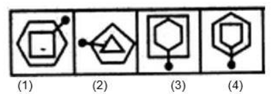
- (A) (1)
- (B) (2)
- (C) (3)
- (D) (4)
**Answer:** (D)
**Explanation:** Only in figure (4) the pin passes through a vertex of each of the two elements.

### Q79. Choose the figure which is different from the rest.
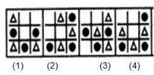
- (A) (1)
- (B) (2)
- (C) (3)
- (D) (4)
**Answer:** (C)
**Explanation:** In all other figures none of the elements is at the central position and the elements are arranged alternately at outer positions.

### Q80. Choose the figure which is different from the rest.
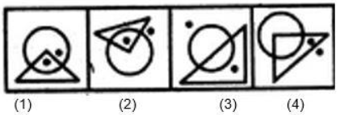
- (A) (1)
- (B) (2)
- (C) (3)
- (D) (4)
**Answer:** (A)
**Explanation:** In all other figures one of the dots lies outside both the triangle and the circle.

### Q81. Select the figure that replaces the question mark.
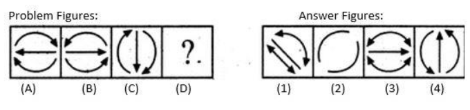
- (A) (1)
- (B) (2)
- (C) (3)
- (D) (4)
**Answer:** (D)
**Explanation:** In each successive figure all the arrows reverse their directions.

### Q82. Select the figure that replaces the question mark.
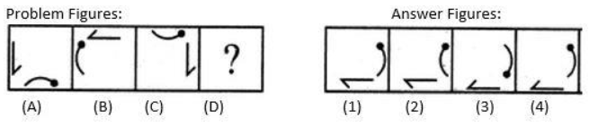
- (A) (1)
- (B) (2)
- (C) (3)
- (D) (4)
**Answer:** (D)
**Explanation:** The half-arrow rotates 90° anti-clockwise, gets laterally inverted and moves clockwise; the bent pin also rotates 90° anti-clockwise and moves clockwise.

### Q83. Select the figure that replaces the question mark.
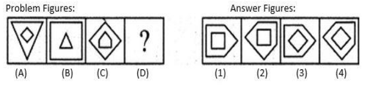
- (A) (1)
- (B) (2)
- (C) (3)
- (D) (4)
**Answer:** (D)
**Explanation:** The inner element enlarges, rotates 45° clockwise and becomes the outer element; the outer element reduces, inverts vertically and becomes the inner element.

### Q84. Select the figure that replaces the question mark.
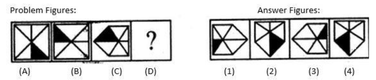
- (A) (1)
- (B) (2)
- (C) (3)
- (D) (4)
**Answer:** (B)
**Explanation:** The figure rotates 90° clockwise and gets laterally inverted in each step.

### Q85. Select the figure that replaces the question mark.
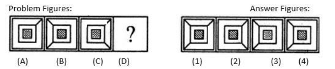
- (A) (1)
- (B) (2)
- (C) (3)
- (D) (4)
**Answer:** (A)
**Explanation:** Line segments move to adjacent corners anti-clockwise and a new segment appears; the shading pattern inside also changes systematically.

### Q86. Which of the following diagrams indicates the best relation between Salary, Savings, Expenditure?
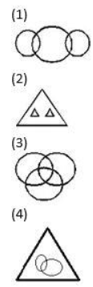
- (A) (1)
- (B) (2)
- (C) (3)
- (D) (4)
**Answer:** (B)
**Explanation:** Savings and Expenditure are two disjoint parts that together constitute Salary.

### Q87. Which of the following diagrams indicates the best relation between Tiger, Giraffe and Animals?
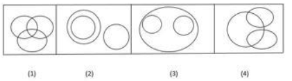
- (A) (1)
- (B) (2)
- (C) (3)
- (D) (4)
**Answer:** (C)
**Explanation:** Tiger and Giraffe are entirely different from each other but both belong to the larger set of Animals.

### Q88. Which of the following diagrams indicates the best relation between Solid common salt (hygroscopic, crystalline and non-electrolytic)?
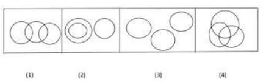
- (A) (1)
- (B) (2)
- (C) (3)
- (D) (4)
**Answer:** (D)
**Explanation:** All three properties (hygroscopic, crystalline, non-electrolytic) belong to the same substance – solid common salt – indicating complete overlap.

### Q89. Which of the following diagrams indicates the best relation between students, intelligent, players.
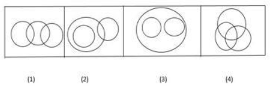
- (A) (1)
- (B) (2)
- (C) (3)
- (D) (4)
**Answer:** (D)
**Explanation:** Some students are intelligent, some are players, and some are both; some intelligent persons and players may not be students.

### Q90. Which of the following diagrams indicates the best relation between lotus, flower and branches?
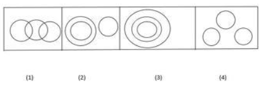
- (A) (1)
- (B) (2)
- (C) (3)
- (D) (4)
**Answer:** (B)
**Explanation:** Lotus is a type of flower; branches form a completely different set.

### Q91. Select the figure that completes the pattern.
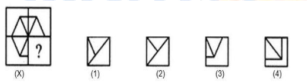
- (A) (1)
- (B) (2)
- (C) (3)
- (D) (4)
**Answer:** (C)
**Explanation:** Option (C) completes the symmetry of the given figure.

### Q92. Select the figure that completes the pattern.
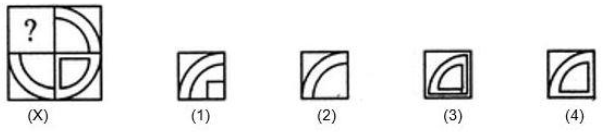
- (A) (1)
- (B) (2)
- (C) (3)
- (D) (4)
**Answer:** (D)
**Explanation:** Option (D) completes the circular arcs pattern.

### Q93. Select the figure that completes the pattern.
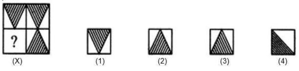
- (A) (1)
- (B) (2)
- (C) (3)
- (D) (4)
**Answer:** (C)
**Explanation:** Option (C) completes the shaded triangle pattern.

### Q94. Select the figure that completes the pattern.
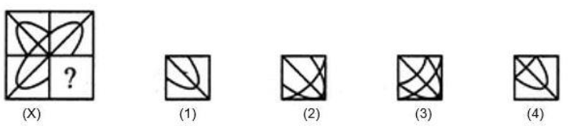
- (A) (1)
- (B) (2)
- (C) (3)
- (D) (4)
**Answer:** (D)
**Explanation:** Option (D) completes the intersecting lines pattern.

### Q95. Select the figure that completes the pattern.
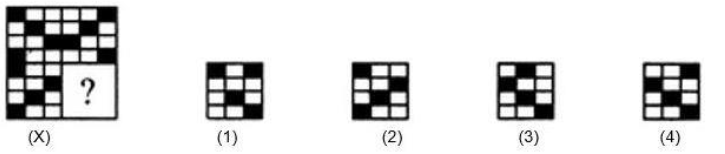
- (A) (1)
- (B) (2)
- (C) (3)
- (D) (4)
**Answer:** (D)
**Explanation:** Option (D) completes the black-and-white square grid pattern.

### Q96. Select the next figure in the series.
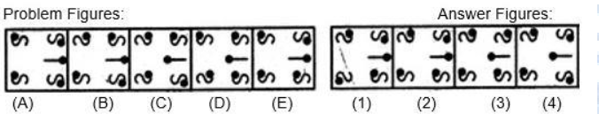
- (A) (1)
- (B) (2)
- (C) (3)
- (D) (4)
**Answer:** (B)
**Explanation:** The upper-left element laterally inverts in alternate steps; the other elements follow periodic rotation and inversion rules.

### Q97. Select the next figure in the series.
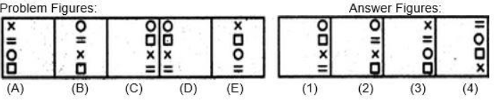
- (A) (1)
- (B) (2)
- (C) (3)
- (D) (4)
**Answer:** (C)
**Explanation:** Elements shift one position right cyclically; the interchange pattern of 1st-3rd, then 2nd-4th, then none, repeats.

### Q98. Select the next figure in the series.
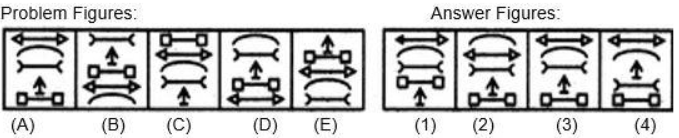
- (A) (1)
- (B) (2)
- (C) (3)
- (D) (4)
**Answer:** (C)
**Explanation:** Elements move according to a fixed cyclic order in each successive step.

### Q99. Select the next figure in the series.
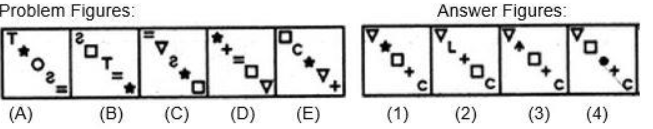
- (A) (1)
- (B) (2)
- (C) (3)
- (D) (4)
**Answer:** (C)
**Explanation:** Symbols move in a fixed sequence; the symbol that reaches a special position is replaced by a new symbol.

### Q100. Select the next figure in the series.
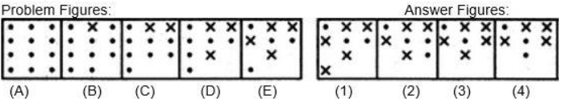
- (A) (1)
- (B) (2)
- (C) (3)
- (D) (4)
**Answer:** (C)
**Explanation:** In each step one dot is lost while another dot is replaced by a cross.