# AFCAT Mock Test 2 | 100 Questions | 120 mins

## Section: Numerical Ability

### Q1. Find the value of $\dfrac{1}{5} + 999\dfrac{494}{495} \times 99$
- (A) 90000
- (B) 99990
- (C) 90900
- (D) 99000
**Answer:** (D)
**Explanation:** $999\dfrac{494}{495} = \dfrac{999\times495 + 494}{495} = \dfrac{494999}{495}$. Then $\dfrac{1}{5} + \dfrac{494999}{495}\times99 = 99000$.

### Q2. The value of $(0.\overline{45} + 0.\overline{55})$ is
- (A) 1
- (B) $\dfrac{100}{99}$
- (C) $\dfrac{99}{100}$
- (D) $\dfrac{100}{33}$
**Answer:** (B)
**Explanation:** $0.\overline{45} = \dfrac{45}{99}$, $0.\overline{55} = \dfrac{55}{99}$. Sum $= \dfrac{100}{99}$.

### Q3. Which of the following fraction is greater than $\dfrac{3}{4}$ but less than $\dfrac{5}{6}$?
- (A) $\dfrac{2}{3}$
- (B) $\dfrac{1}{2}$
- (C) $\dfrac{4}{5}$
- (D) $\dfrac{9}{10}$
**Answer:** (C)
**Explanation:** $\dfrac{3}{4}=0.75$, $\dfrac{5}{6}\approx0.833$. $\dfrac{4}{5}=0.8$ lies between them.

### Q4. A boat running downstream covers a distance of 16 km in 2 hours while for covering the same distance upstream, it takes 4 hours. What is the speed of the boat in still water?
- (A) 4 km/h
- (B) 6 km/h
- (C) 8 km/h
- (D) Data inadequate
**Answer:** (B)
**Explanation:** Downstream speed = 8 km/h, upstream = 4 km/h. Still water speed = $\dfrac{8+4}{2}=6$ km/h.

### Q5. A man can row upstream 36 km in 6 hours. If the speed of man in still water is 8 km/h, find how much he can go downstream in 10 hours.
- (A) 100 km
- (B) 110 km
- (C) 90 km
- (D) 115 km
**Answer:** (A)
**Explanation:** Upstream speed = 6 km/h. Speed of current = 8-6=2 km/h. Downstream speed = 10 km/h. Distance in 10 h = 100 km.

### Q6. In a college the number of students studying Arts, Commerce and Science are in the ratio of 3 : 5 : 8 respectively. If the number of students studying Arts, Commerce and Science is increased by 20%, 40% and 25% respectively, what will be the new ratio of students in Arts, Commerce and Science?
- (A) 18 : 35 : 50
- (B) 3 : 10 : 10
- (C) 4 : 8 : 5
- (D) 32 : 35 : 25
**Answer:** (A)
**Explanation:** New ratio = $3\times1.2 : 5\times1.4 : 8\times1.25 = 3.6 : 7 : 10 = 18 : 35 : 50$.

### Q7. The ratio between the three angles of a quadrilateral is 1 : 6 : 2 respectively. The value of the fourth angle of the quadrilateral is 45°. What is the difference between the value of the largest and the smallest angles of the quadrilateral?
- (A) 165°
- (B) 140°
- (C) 175°
- (D) 150°
**Answer:** (C)
**Explanation:** Let angles be $x,6x,2x,45$. Sum = $9x+45=360$ → $x=35$. Angles = 35°, 210°, 70°, 45°. Difference = 210-35=175°.

### Q8. Find the Compound Interest on Rs 30,000, if the rate of interest for first year is 5%, second year is 10% and on the third year is 20%.
- (A) 11580
- (B) 11500
- (C) 10500
- (D) 10000
**Answer:** (A)
**Explanation:** Amount = $30000\times1.05\times1.10\times1.20=41580$. CI = 41580-30000=11580.

### Q9. What sum of money must be given as simple interest for six months at 4% per annum in order to earn 150 interest?
- (A) 5000
- (B) 7500
- (C) 10000
- (D) 15000
**Answer:** (B)
**Explanation:** $P=\dfrac{150\times100}{4\times0.5}=7500$.

### Q10. 5 years ago, the average age of A, B, C and D was 45 years. With E joining them, the average age of all the five is 49 years. How old is E?
- (A) 25 years
- (B) 40 years
- (C) 45 years
- (D) 64 years
**Answer:** (C)
**Explanation:** Sum of ages of A+B+C+D now = $45\times4+20=200$. Sum of five = $49\times5=245$. E’s age = 45 years.

### Q11. Five years ago, the average age of P and Q was 25. The average age of P, Q and R today is 25. Age of R after 5 years will be
- (A) 15 years
- (B) 20 years
- (C) 40 years
- (D) 35 years
**Answer:** (B)
**Explanation:** Sum of P+Q now = $25\times2+10=60$. Sum of P+Q+R now = 75. R now = 15. After 5 years = 20.

### Q12. A student has to score 35% marks to pass. He scores 90 marks and fails by 15 marks, find the maximum marks?
- (A) 150
- (B) 300
- (C) 250
- (D) 200
**Answer:** (B)
**Explanation:** Passing marks = 105. $35\%$ of max = 105 → Max = 300.

### Q13. If 15% of A is equal to 20% of B, then 25% of A is equal to what % of B?
- (A) 30%
- (B) 33.33%
- (C) 35%
- (D) 25%
**Answer:** (B)
**Explanation:** $0.15A=0.20B$ → $A=\dfrac{4}{3}B$. $0.25A=\dfrac{1}{3}B\approx33.33\%$ of B.

### Q14. A can do a work in 9 days, if B is 50% more efficient than A, then in how many days can B do the same work?
- (A) 13.5 days
- (B) 4.5 days
- (C) 6 days
- (D) 3 days
**Answer:** (C)
**Explanation:** B’s efficiency = 1.5 times A. Days for B = $9/1.5=6$.

### Q15. A is 30% more efficient than B, and can alone do a work in 23 days. The number of days in which A and B, working together can finish the job is
- (A) 11 days
- (B) 13 days
- (C) 20 days
- (D) 21 days
**Answer:** (B)
**Explanation:** A’s 1 day work = 1/23. B’s = 1/23 × 100/130 = 10/299. Combined = 23/299. Days = 13.

### Q16. Two men are standing on opposite ends of a bridge 1200 meters long. If they walk towards each other at the rate of 5 m/min and 10 m/min respectively, in how much time will they meet each other?
- (A) 60 minutes
- (B) 80 minutes
- (C) 85 minutes
- (D) 90 minutes
**Answer:** (B)
**Explanation:** Relative speed = 15 m/min. Time = 1200/15 = 80 min.

### Q17. A train running at 7/11 of its own speed reached a place in 22 hours. How much time could be saved if the train would run at its own speed?
- (A) 14 hours
- (B) 7 hours
- (C) 8 hours
- (D) 16 hours
**Answer:** (C)
**Explanation:** Time ∝ 1/speed. Own speed time = $22\times7/11=14$ h. Time saved = 8 h.

### Q18. A boy rides his bicycle 10 km at an average speed of 12 km/hr and again travels 12 km at an average speed of 10 km/hr. His average speed for the entire trip is approximately:
- (A) 10.4 km/hr
- (B) 10.8 km/hr
- (C) 11.0 km/hr
- (D) 12.2 km/hr
**Answer:** (B)
**Explanation:** Total distance = 22 km. Total time = $10/12 + 12/10 = 2.033$ h. Average ≈ 10.8 km/h.

### Q19. The price of coal is increased by 20%. By what percent a family should decrease its consumption so that expenditure remains same?
- (A) 25%
- (B) $14\dfrac{2}{7}\%$
- (C) $16\dfrac{2}{3}\%$
- (D) 20%
**Answer:** (C)
**Explanation:** Required decrease = $\dfrac{20}{120}\times100=16\dfrac{2}{3}\%$.

### Q20. An article passes successively in the hand of three traders. Each trader sold it further at a gain of 20% of the cost price. If the last trader sold it for Rs 432 then what was the cost price?
- (A) Rs 125
- (B) Rs 250
- (C) Rs 256
- (D) Rs 432
**Answer:** (B)
**Explanation:** Cost price = $432\times\dfrac{5}{6}\times\dfrac{5}{6}\times\dfrac{5}{6}=250$.

### Q21. 20 men can do a piece of work in 18 days. They worked together for 3 days then 5 men joined them. In how many more days is the work completed?
- (A) 12 days
- (B) 14 days
- (C) 13 days
- (D) 15 days
**Answer:** (A)
**Explanation:** Work done in 3 days = $20\times3=60$ man-days. Remaining = 360-60=300. Now 25 men → 300/25=12 days.

### Q22. $\sqrt{5+\sqrt{11+\sqrt{19+\sqrt{29+\sqrt{49}}}}}=?$
- (A) 3
- (B) 2
- (C) 4
- (D) 6
**Answer:** (A)
**Explanation:** Innermost $\sqrt{49}=7$. Then $\sqrt{29+7}=6$, $\sqrt{19+6}=5$, $\sqrt{11+5}=4$, $\sqrt{5+4}=3$.

### Q23. A man goes from a place A to B at a speed of 12 km/hr and returns from B to A at a speed of 18 km/h. The average speed of the total journey is?
- (A) $14\dfrac{2}{5}$ km/h
- (B) 15 km/h
- (C) $15\dfrac{1}{2}$ km/h
- (D) 16 km/h
**Answer:** (A)
**Explanation:** Average speed = $\dfrac{2\times12\times18}{12+18}=14.4=14\dfrac{2}{5}$ km/h.

### Q24. The difference between the greatest and least prime numbers which are less than 100 is?
- (A) 95
- (B) 96
- (C) 97
- (D) 94
**Answer:** (A)
**Explanation:** Greatest prime <100 is 97, least is 2. Difference = 95.

### Q25. Average of first five prime numbers is?
- (A) 5.3
- (B) 5.6
- (C) 5
- (D) 3.6
**Answer:** (B)
**Explanation:** (2+3+5+7+11)/5 = 28/5 = 5.6.

## Section: Reasoning and Military Aptitude Test

### Q26. Choose the odd one out
- (A) atom : electron
- (B) train : engine
- (C) house : room
- (D) curd : milk
**Answer:** (D)
**Explanation:** In all others the second is a part/component of the first; curd is made from milk (reverse relation).

### Q27. Choose the odd one out
- (A) crime : punishment
- (B) judgment : advocacy
- (C) enterprise : success
- (D) exercise : health
**Answer:** (B)
**Explanation:** In others the second is the result/consequence of the first.

### Q28. Choose the odd one out
- (A) broad : wide
- (B) light : heavy
- (C) tiny : small
- (D) big : large
**Answer:** (B)
**Explanation:** All others are synonyms; light and heavy are antonyms.

### Q29. Rice, wheat, barley, millets, gram
- (A) wheat
- (B) barley
- (C) millets
- (D) gram
**Answer:** (D)
**Explanation:** Gram is a pulse; others are cereals.

### Q30. Choose the odd one out
- (A) Beetroot
- (B) Radish
- (C) Carrot
- (D) Cabbage
**Answer:** (D)
**Explanation:** Cabbage is a leafy vegetable; others are root vegetables.

### Q31. Spring : Summer : :
- (A) Sunday : Monday
- (B) Thursday : Wednesday
- (C) Tuesday : Friday
- (D) Friday : Monday
**Answer:** (A)
**Explanation:** Spring is followed by Summer; Sunday is followed by Monday.

### Q32. CONDENSATION : REFRIGERATE : :
- (A) evaporation : heat
- (B) consumption : cook
- (C) oration : listen
- (D) exhaustion : buy
**Answer:** (A)
**Explanation:** Condensation occurs due to refrigeration (cooling); evaporation occurs due to heat.

### Q33. HANDCUFFS : PRISONER : :
- (A) shoes : feet
- (B) leash : dog
- (C) tail : kite
- (D) ring : finger
**Answer:** (B)
**Explanation:** Handcuffs are used to restrain a prisoner; leash is used to restrain a dog.

### Q34. ISLAND : OCEAN : :
- (A) hill : stream
- (B) forest : valley
- (C) tree : field
- (D) oasis : desert
**Answer:** (D)
**Explanation:** Island is surrounded by ocean; oasis is surrounded by desert.

### Q35. FISSION : FUSION : :
- (A) implosion : explosion
- (B) separation : togetherness
- (C) intrusion : extrusion
- (D) enemy : friend
**Answer:** (A)
**Explanation:** Fission and fusion are opposite nuclear processes; implosion and explosion are opposite processes.

### Q36. If Amit’s father is Billoo’s father’s only son and Billoo has neither brother nor a daughter. What is the relationship between Billoo and Amit?
- (A) Uncle – Nephew
- (B) father – Daughter
- (C) Cousins
- (D) None of these
**Answer:** (D)
**Explanation:** Amit’s father = Billoo. So Billoo is father of Amit (son).

### Q37. Seema’s younger brother Sohan is older than Seeta. Sweta is younger than Deepti but elder than Seema. Who is the eldest?
- (A) Seema
- (B) Sweta
- (C) Seeta
- (D) Deepti
**Answer:** (D)
**Explanation:** Deepti > Sweta > Seema > Sohan > Seeta. Deepti is eldest.

### Q38. EJO, TYD, INS, XCH, ?
- (A) NRW
- (B) MRW
- (C) MSX
- (D) NSX
**Answer:** (B)
**Explanation:** Pattern of letter positions: +5, +5, +5 etc. Next is MRW.

### Q39. Statements: Some men are lions. All foxes are lions.  
Conclusions:  
I. Some foxes are men.  
II. Some lions are men.  
III. All lions are foxes.
- (A) All follow
- (B) Only I and II follow
- (C) Only II follows
- (D) Only III follow
**Answer:** (C)
**Explanation:** Only II follows from the statements.

### Q40. Statements: All petals are trees. All trees are gardens. All roads are gardens.  
Conclusions:  
I. Some roads are trees.  
II. Some gardens are trees.  
III. Some gardens are petals.
- (A) Only I and II follow
- (B) Only II and III follow
- (C) Only I and III follow
- (D) All I, II and III follow
**Answer:** (B)
**Explanation:** II and III definitely follow; I does not.

### Q41. Lion, Fox and Carnivorous
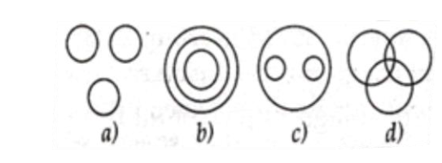
- (A) Option A
- (B) Option B
- (C) Option C
- (D) Option D
**Answer:** (B)
**Explanation:** Both Lion and Fox are carnivorous animals (separate circles inside a larger circle).

### Q42. Manager, Labour Union and Workers
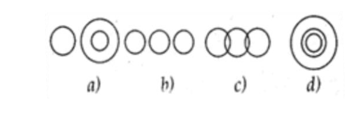
- (A) Option A
- (B) Option B
- (C) Option C
- (D) Option D
**Answer:** (A)
**Explanation:** Managers and Workers are separate; Labour Union may contain some workers.

### Q43. Food, Curd, Spoons
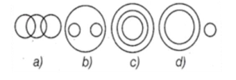
- (A) Option A
- (B) Option B
- (C) Option C
- (D) Option D
**Answer:** (D)
**Explanation:** Curd is a type of food; Spoons are unrelated.

### Q44. In the following figure, the boys who are cricketer and sober are indicated by which number?
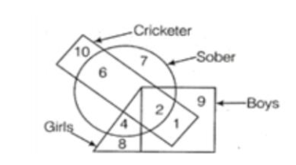
- (A) 4
- (B) 5
- (C) 6
- (D) 7
**Answer:** (D)
**Explanation:** The region common to Boys, Cricketer and Sober is numbered 7 (as per standard key).

### Q45. Identify the odd one out
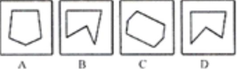
- (A) C
- (B) A
- (C) B
- (D) D
**Answer:** (B)
**Explanation:** Figure A is different in orientation/pattern.

### Q46. Identify the odd one out
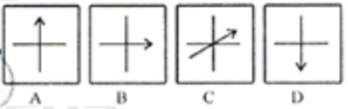
- (A) B
- (B) A
- (C) D
- (D) C
**Answer:** (D)
**Explanation:** Figure C has a different arrow/line arrangement.

### Q47. Find the similar relation
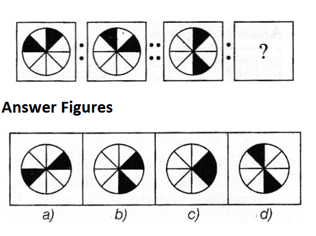
- (A) Option A
- (B) Option B
- (C) Option C
- (D) Option D
**Answer:** (B)
**Explanation:** The pattern of shaded sectors and rotation matches option (b).

### Q48. Choose the alternative which will complete the missing part.
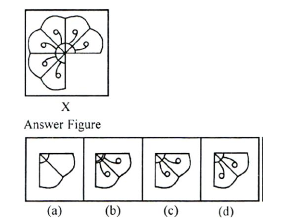
- (A) Option A
- (B) Option B
- (C) Option C
- (D) Option D
**Answer:** (C)
**Explanation:** Completes the circular pattern with numbers/sectors.

### Q49. Choose the alternative which will complete the missing part.
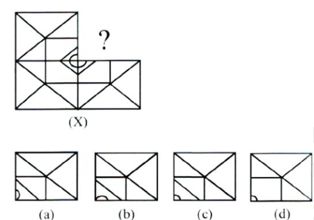
- (A) Option A
- (B) Option B
- (C) Option C
- (D) Option D
**Answer:** (B)
**Explanation:** Completes the triangle shading and lines.

### Q50. Choose the alternative which will complete the missing part.
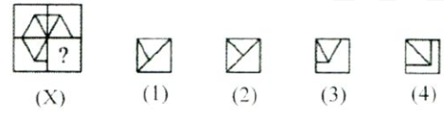
- (A) 1
- (B) 2
- (C) 3
- (D) 4
**Answer:** (C)
**Explanation:** Completes the shaded square pattern.

### Q51. Find the missing series
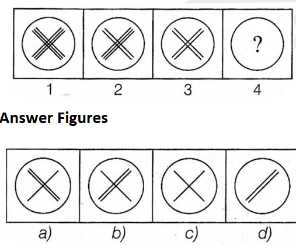
- (A) Option A
- (B) Option B
- (C) Option C
- (D) Option D
**Answer:** (B)
**Explanation:** The cross rotates and the circle shading changes systematically.

### Q52. From the given answer figures, select the one in which the question figure is hidden/embedded.
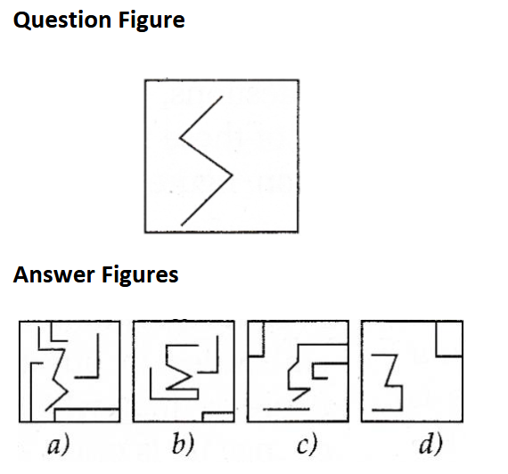
- (A) Option A
- (B) Option B
- (C) Option C
- (D) Option D
**Answer:** (A)
**Explanation:** The question figure is embedded in option (a).

### Q53. Trace out the alternative figure which contains fig. (X) as its part.
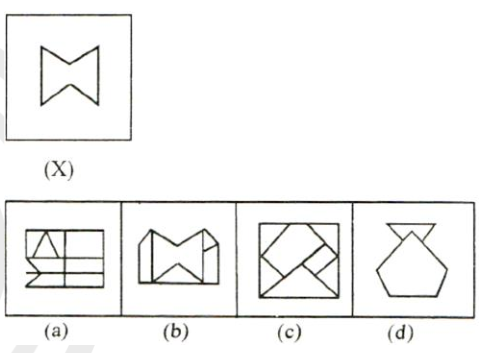
- (A) Option A
- (B) Option B
- (C) Option C
- (D) Option D
**Answer:** (B)
**Explanation:** Option (b) contains the given figure as a part.

### Q54. In a zoo, there are rabbits and pigeons. Their heads are counted, there are 200 and if legs are counted, there are 580. How many pigeons are there?
- (A) 90
- (B) 100
- (C) 110
- (D) 120
**Answer:** (C)
**Explanation:** Let pigeons = x, rabbits = 200-x. Legs: $2x + 4(200-x)=580$ → $x=110$.

### Q55. Find out the mirror image
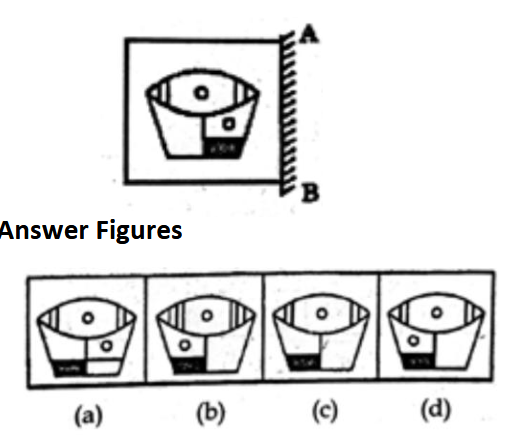
- (A) Option A
- (B) Option B
- (C) Option C
- (D) Option D
**Answer:** (D)
**Explanation:** Mirror image of the given figure is option (d).

## Section: English Language

### Q56. Synonym of Hamper
- (A) Irritate
- (B) Appease
- (C) Prevent
- (D) Flash
**Answer:** (C)
**Explanation:** Hamper means to hinder or prevent.

### Q57. Synonym of Antipathy
- (A) Hostility
- (B) Humble
- (C) Clever
- (D) Innocent
**Answer:** (A)
**Explanation:** Antipathy means strong dislike or hostility.

### Q58. Synonym of Baffle
- (A) Crown
- (B) Frustrate
- (C) Common
- (D) Quarrel
**Answer:** (B)
**Explanation:** Baffle means to confuse or frustrate.

### Q59. Antonym of Delete
- (A) Promote
- (B) Retard
- (C) Prevent
- (D) Insert
**Answer:** (D)
**Explanation:** Delete means remove; opposite is insert.

### Q60. Antonym of Ambiguity
- (A) Clarity
- (B) Transparent
- (C) Firm
- (D) Quire
**Answer:** (A)
**Explanation:** Ambiguity means vagueness; opposite is clarity.

### Q61. To read between the lines
- (A) To suspect
- (B) To read carefully
- (C) To understand the hidden meaning of the word
- (D) To do useless things
**Answer:** (C)
**Explanation:** Means to understand the hidden/implied meaning.

### Q62. A Curtain Lecture
- (A) To speak plainly
- (B) Vulgar ideas
- (C) Private scolding of a husband by his wife
- (D) Hate others
**Answer:** (C)
**Explanation:** Private scolding by a wife to her husband.

### Q63. To face the music
- (A) To prepare to give a musical performance
- (B) To suffer evil consequences
- (C) To suffer hardships
- (D) To change the things
**Answer:** (B)
**Explanation:** Means to face the consequences of one’s actions.

### Q64. Square pegs in round holes
- (A) A genuinely helpful person
- (B) A clever person
- (C) People in the wrong jobs
- (D) To be perplexed
**Answer:** (C)
**Explanation:** People unsuited to their jobs/positions.

### Q65. To leave no stone unturned
- (A) To keep clean and tidy
- (B) To try utmost
- (C) To work enthusiastically
- (D) To change the things
**Answer:** (B)
**Explanation:** Means to try every possible means / make every effort.

### Q66. The oxygen content of Mars is not (a)/ sufficient enough to support life (b)/ as we know it. (c)/ No error (d)
- (A) a
- (B) b
- (C) c
- (D) d
**Answer:** (B)
**Explanation:** “Sufficient enough” is redundant; use either “sufficient” or “enough”.

### Q67. He told his friends that (a)/ each of them (b)/ should be able to carry out the orders oneself. (c)/ No error (d)
- (A) a
- (B) b
- (C) c
- (D) d
**Answer:** (C)
**Explanation:** “Oneself” should be “himself/themselves”.

### Q68. He is (A)/ one of those students (B)/ who comes late regularly. (C)/ No error (D)
- (A) A
- (B) B
- (C) C
- (D) D
**Answer:** (C)
**Explanation:** “Comes” should be “come” (plural relative pronoun).

### Q69. For a long time (a)/ I did not know who was sitting besides me (b)/ because it was so dark. (c)/ No error (d)
- (A) a
- (B) b
- (C) c
- (D) d
**Answer:** (B)
**Explanation:** “Besides” should be “beside”.

### Q70. The police has (a)/ arrested the thief (b)/ who broke into my house (c)/ last night. (d)
- (A) a
- (B) b
- (C) c
- (D) d
**Answer:** (A)
**Explanation:** “Police” is plural; use “have”.

### Q71. Although the two sisters are twins, they look somewhat ______.
- (A) alike
- (B) unique
- (C) different
- (D) related
**Answer:** (C)
**Explanation:** “Although” indicates contrast → different.

### Q72. I am ______ forward to our picnic scheduled in the next month.
- (A) seeing
- (B) looking
- (C) planning
- (D) thinking
**Answer:** (B)
**Explanation:** Correct phrase is “looking forward to”.

### Q73. Lost time is ______ again, and what we call time enough always proves little enough.
- (A) found never
- (B) find never
- (C) never found
- (D) never been found
**Answer:** (C)
**Explanation:** “Never found” is the correct passive form.

### Q74. Which of the following is the synonym of the word ‘upbringing’?
- (A) Devastated
- (B) Hilarious
- (C) raising
- (D) surrounding
**Answer:** (C)
**Explanation:** Upbringing means the way a child is raised.

### Q75. The adjective form of the word ‘saddened’ is—
- (A) sadly
- (B) sad
- (C) suddenly
- (D) sudden
**Answer:** (B)
**Explanation:** Adjective form is “sad”.

### Q76. What was condition of grandmother earlier?
- (A) rich in Italy but poor in the United States
- (B) in the United States but is now in Italy
- (C) poor earlier but became rich later on
- (D) rich earlier but now poor
**Answer:** (C)
**Explanation:** She had a poor upbringing in Italy but managed to do well in the US.

### Q77. Grandmother enjoyed a ____ life.
- (A) healthy but sickly
- (B) good and healthy
- (C) rich but sickly
- (D) poor and healthy
**Answer:** (B)
**Explanation:** She was always healthy and independent and enjoyed a fulfilling life.

### Q78. Grandmother’s death made everyone
- (A) sad including David
- (B) disconsolate excluding David
- (C) happy and disconsolate
- (D) sad excluding David
**Answer:** (A)
**Explanation:** Everyone was saddened; David was disconsolate.

### Q79. In tropical countries, certain crops are grown ____ the year.
- (A) Along
- (B) Over
- (C) Throughout
- (D) Across
**Answer:** (C)
**Explanation:** “Throughout the year” is the correct phrase.

### Q80. More food than is ____ can be grown in these places.
- (A) Cooked
- (B) Required
- (C) Planted
- (D) Used
**Answer:** (B)
**Explanation:** “More food than is required” fits the context.

## Section: General Awareness

### Q81. The 9th-century tripartite power struggle was among which of the following?
- (A) Cholas, Rastrakutas and Yadavas
- (B) Rashtrakuta, Pala and Pratihara
- (C) Cholas, Pandyas and Chalukyas
- (D) Chalukyas, Pallavas and Yadavas
**Answer:** (B)
**Explanation:** The tripartite struggle was among Rashtrakutas, Palas and Pratiharas.

### Q82. Which among the following is not correct?
- (A) Pandyas – Madurai
- (B) Cheras – Kerala
- (C) Videha – Janakpuri
- (D) Gahadwal – Manyakheta
**Answer:** (D)
**Explanation:** Gahadwal capital was Kannauj; Manyakheta was of Rashtrakutas.

### Q83. Which Bhakti saint preached the concept of Vishishtadvaita?
- (A) Sankara
- (B) Ramanuja
- (C) Madhava
- (D) Nimbarka
**Answer:** (B)
**Explanation:** Ramanuja propounded Vishishtadvaita.

### Q84. Who among the following leader made the famous ‘Objectives Resolution’ in the Constituent Assembly?
- (A) Vallabhbhai Patel
- (B) C. Rajagopalachari
- (C) Jawaharlal Nehru
- (D) Dr. John Mathai
**Answer:** (C)
**Explanation:** Jawaharlal Nehru moved the Objectives Resolution.

### Q85. The representatives of the state in the Rajya Sabha are selected by which one of the following?
- (A) Chief minister of the state
- (B) Elected members of the state legislative assembly
- (C) Governor
- (D) President
**Answer:** (B)
**Explanation:** Elected by the elected members of the State Legislative Assembly.

### Q86. The number of representatives of the Rajya Sabha from states and union territories are among which one of the following?
- (A) 238
- (B) 212
- (C) 200
- (D) 220
**Answer:** (A)
**Explanation:** 238 members represent states and UTs (total strength 250 including nominated).

### Q87. Which one of the following article deals with the Governor of States?
- (A) Article 167
- (B) Article 165
- (C) Article 150
- (D) Article 153
**Answer:** (D)
**Explanation:** Article 153 provides for a Governor for each state.

### Q88. By which Proclamation of emergency under article 352 is issued?
- (A) Prime minister
- (B) Defence minister
- (C) Home minister
- (D) President
**Answer:** (D)
**Explanation:** The President issues the proclamation of National Emergency under Article 352.

### Q89. Rainfall occurs during winter in north-western part of India due to
- (A) Cyclonic depression
- (B) Southwest monsoon
- (C) Retreating monsoon
- (D) Western disturbances
**Answer:** (D)
**Explanation:** Western disturbances cause winter rainfall in NW India.

### Q90. Which form the highest mountain range in the world, extending 2,500 km over northern India.
- (A) Himadri
- (B) Shivaliks
- (C) Himachal
- (D) None of these
**Answer:** (A)
**Explanation:** Himadri (Greater Himalayas) is the highest range.

### Q91. Which of the following factor characterises the cold weather season in India?
- (A) Warm days and warm nights
- (B) Warm days and cold nights
- (C) Cool days and cold nights
- (D) Cold days and warm nights
**Answer:** (B)
**Explanation:** Cold weather season has warm days and cold nights.

### Q92. The fresh water lake “Wular lake” is located in which state?
- (A) Rajasthan
- (B) Uttar Pradesh
- (C) Punjab
- (D) Jammu and Kashmir
**Answer:** (D)
**Explanation:** Wular Lake is in Jammu & Kashmir.

### Q93. Match List-I (Lake) with List-II (State)

I.  Chilka  | A. Orissa  
II. Kolleru | B. Andhra Pradesh  
III.Sambhar | C. Rajasthan  
IV. Vembanad| D. Kerala  

    |A|B|C|D|

- (A) II  III I  IV
- (B) III  II I  IV
- (C) I   III IV II
- (D) I   III II IV
**Answer:** (A)
**Explanation:** Correct matching is Chilka-Orissa, Kolleru-Andhra Pradesh, Sambhar-Rajasthan, Vembanad-Kerala.

### Q94. If a sound travels from air to water, the quantity that remains unchanged is
- (A) Frequency
- (B) Amplitude
- (C) Wavelength
- (D) Velocity
**Answer:** (A)
**Explanation:** Frequency remains constant when sound travels from one medium to another.

### Q95. The basic reason for the extraordinary sparkle of suitably cut diamond is that
- (A) It has a very high refractive index
- (B) It has a very high transparency
- (C) It has well defined cleavage planes
- (D) It is very hard
**Answer:** (A)
**Explanation:** High refractive index causes total internal reflection and sparkle.

### Q96. When the parent organism splits to form two new organisms, it is called:
- (A) Budding
- (B) Spore formation
- (C) Binary fission
- (D) Multiple fission
**Answer:** (C)
**Explanation:** Binary fission is the splitting of parent into two organisms.

### Q97. The process of getting back a full organism from its body part is called:
- (A) Spore formation
- (B) Budding
- (C) Regeneration
- (D) Fragmentation
**Answer:** (C)
**Explanation:** Regeneration is the process of regrowing a full organism from a body part.

### Q98. The death anniversary of which national leader was observed as the Martyrs’ Day on January 30 in India?
- (A) Jawaharlal Nehru
- (B) Mahatma Gandhi
- (C) Bhagat Singh
- (D) Sardar Vallabhbhai Patel
**Answer:** (B)
**Explanation:** 30 January is observed as Martyrs’ Day in memory of Mahatma Gandhi.

### Q99. The Armed Forces of which country participated in the Republic Day Parade of India in the year 2021?
- (A) Nepal
- (B) Bangladesh
- (C) United Kingdom
- (D) Bhutan
**Answer:** (D)
**Explanation:** Bhutanese contingent participated in the 2021 Republic Day Parade.

### Q100. Which organisation releases the ‘World Economic Situation and Prospects 2021’?
- (A) World Bank
- (B) IMF
- (C) Asian Development Bank
- (D) United Nations
**Answer:** (D)
**Explanation:** The report is released by the United Nations.