FILENAME: TERRITORIAL ARMY COMMISSION (TAC) Practice Test Paper - 2 | 100 Questions | 120 mins.md

# TERRITORIAL ARMY COMMISSION (TAC) Practice Test Paper - 2 | 100 Questions | 120 mins

### Section: Reasoning
#### Q1. Which of the following diagrams indicates the best relation between Doctors, Human Beings and Married People?
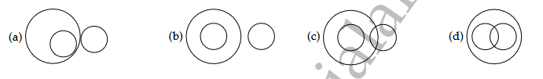
- (A) 
- (B) 
- (C) 
- (D) 
**Answer:** D
**Explanation:** Some doctors can be married. Both doctors and married people belong to the group of human beings.

#### Q2. Which of the following diagrams indicates the best relation between Judge, Thieves and Criminals?
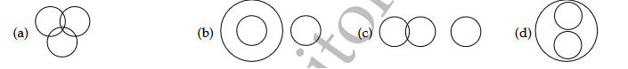
- (A) 
- (B) 
- (C) 
- (D) 
**Answer:** B
**Explanation:** Thieves belong to the category of criminals. Judge is a separate entity.

#### Q3. Which of the following diagrams indicates the best relation between Judge, Thieves and Criminals?
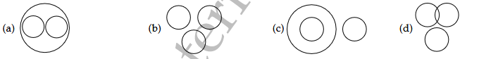
- (A) 
- (B) 
- (C) 
- (D) 
**Answer:** D
**Explanation:** Some man can be workers while some workers can be man. Garden is a separate entity.

#### Q4. Which of the following diagrams indicates the best relation between Earth, Sea and Sun?
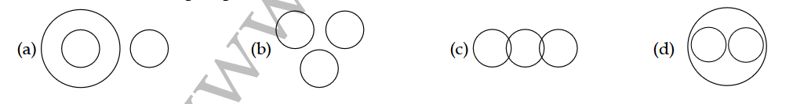
- (A) 
- (B) 
- (C) 
- (D) 
**Answer:** A
**Explanation:** Earth contains Sea; Sun is separate.

#### Q5. In the following figure, the boys who are athletes and disciplined are indicated by which number? The triangle represents girls, the circle athletes, the rectangle boys and the square disciplined.
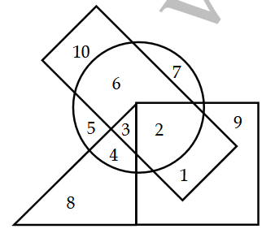
- (A) 1
- (B) 2
- (C) 6
- (D) 10
**Answer:** B
**Explanation:** The required region is the one which is common to the rectangle, circle and square but lies outside the triangle i.e. 2.

#### Q6. In a row of boys, A is thirteenth from the left and D is seventeenth from the right. If in this row A is eleventh from the right then D from the left? what is the position of D from the left?
- (A) 6th
- (B) 7th
- (C) 10th
- (D) 12th
**Answer:** B
**Explanation:** Total boys = 23. D is 7th from left.

#### Q7. In a class of 35 students, Kunal is placed seventh from the bottom whereas Sonali is placed ninth from the top. Pulkit is placed exactly in between the two. What is Kunal's position from Pulkit?
- (A) 9
- (B) 10
- (C) 11
- (D) 13
**Answer:** B
**Explanation:** Kunal is 10th from Pulkit.

#### Q8. Kailash remembers that his brother Deepak's birth day falls after 20th May but before 28th May, while Geeta remembers that Deepak's birthday falls before 22nd May but after 12th May. On what date Deepak's birthday falls?
- (A) 20th May
- (B) 21st May
- (C) 22nd May
- (D) Cannot be determined
**Answer:** B
**Explanation:** Common date is 21st May.

#### Q9. Reaching the place of meeting 20 minutes before 8.50 hrs Sumit found himself thirty minutes earlier than the man who came 40 minutes late. What was the scheduled time of the meeting?
- (A) 8.00
- (B) 8.05
- (C) 8.10
- (D) 8.30
**Answer:** D
**Explanation:** Scheduled time is 8.30 hrs.

#### Q10. If '+* means 'divided by', means 'added to', 'x' means 'subtracted from' and '÷' means 'multiplied by', then what is the value of 24 ÷ 12 - 18 + 9?
- (A) -25
- (B) 0.72
- (C) 15.30
- (D) 290
**Answer:** D
**Explanation:** 24 × 12 + 18 ÷ 9 = 290.

#### Q11. If x means ÷, - means ×, ÷ means + and + means -, then (3 - 15 + 19) × 8 + 6 = ?
- (A) -1
- (B) 2
- (C) 4
- (D) 8
**Answer:** B
**Explanation:** (3 × 15 + 19) ÷ 8 - 6 = 2.

#### Q12. If Q means 'add to', J means 'multiply by', T means 'subtract from' and K means 'divide by', then 30 K 2 Q 3 J 6 T 5 = ?
- (A) 18
- (B) 28
- (C) 31
- (D) 103
**Answer:** B
**Explanation:** 30 ÷ 2 + 3 × 6 - 5 = 28.

#### Q13. Find the missing term.
3 6 8  
5 8 4  
4 7 ?
- (A) 6
- (B) 7
- (C) 8
- (D) 9
**Answer:** A
**Explanation:** Sum of each row is 17. Missing = 6.

#### Q14. Find the missing term.
11 6 8  
17 12 ?  
25 34 19  
19 28 11
- (A) 9
- (B) 13
- (C) 15
- (D) 16
**Answer:** D
**Explanation:** Pattern in columns leads to 16.

#### Q15. Find the missing term.
A2 C4 E6  
G3 I5 ?  
M5 O9 Q14
- (A) J15
- (B) K8
- (C) K15
- (D) L10
**Answer:** B
**Explanation:** Letters +2, numbers sum to third. K8.

#### Q16. Find the missing character in the following figure.
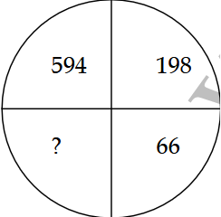
- (A) 11
- (B) 12
- (C) 22
- (D) 33
**Answer:** C
**Explanation:** 594 ÷ 3 = 198, 198 ÷ 3 = 66, 66 ÷ 3 = 22.

#### Q17. Find the missing character in the following figure.
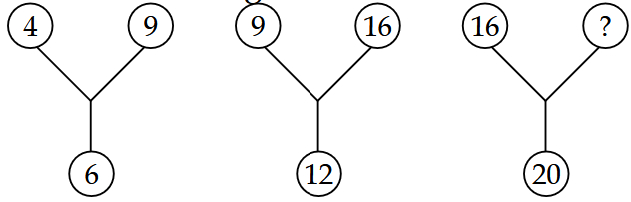
- (A) 21
- (B) 25
- (C) 35
- (D) 45
**Answer:** B
**Explanation:** √16 × √x = 20 → x=25.

#### Q18. Find the missing character in the following figure.
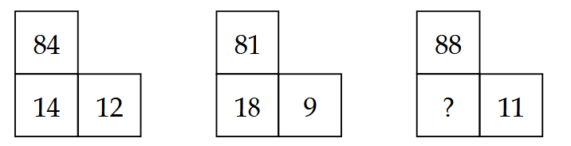
- (A) 16
- (B) 21
- (C) 61
- (D) 81
**Answer:** A
**Explanation:** (11 × x)/2 = 88 → x=16.

#### Q19. Statements: All men are dogs. All dogs are cats. Conclusions: I. All men are cats. II. All cats are men.
- (A) if only conclusion I follows
- (B) if only conclusion II follows
- (C) if neither conclusion I nor II follows
- (D) if both conclusions I and II follow
**Answer:** A
**Explanation:** Only I follows.

#### Q20. Statements: All cars are cats. All fans are cats. Conclusions: I. All cars are fans. II. Some fans are cars.
- (A) if only conclusion I follows
- (B) if only conclusion II follows
- (C) if neither conclusion I nor II follows
- (D) if both conclusions I and II follow
**Answer:** C
**Explanation:** Neither follows.

#### Q21. Statements: All roads are waters. Some waters are boats. Conclusion: I. Some boats are roads. II. All waters are boats.
- (A) if only conclusion I follows
- (B) if only conclusion II follows
- (C) if neither conclusion I nor II follows
- (D) if both conclusions I and II follow
**Answer:** C
**Explanation:** Neither follows.

#### Q22. Statements: All huts are mansions. All mansions are temples. Conclusions: I. Some temples are huts. II. Some temples are mansions.
- (A) if only conclusion I follows
- (B) if only conclusion II follows
- (C) if neither conclusion I nor II follows
- (D) if both conclusions I and II follow
**Answer:** D
**Explanation:** Both follow.

#### Q23. Statements: Every minister is a student. Every student is inexperienced. Conclusions: I. Every minister is inexperienced. II. Some inexperienced are students.
- (A) if only conclusion I follows
- (B) if only conclusion II follows
- (C) if neither conclusion I nor II follows
- (D) if both conclusions I and II follow
**Answer:** D
**Explanation:** Both follow.

#### Q24. Statements: All artists are smokers. Some smokers are drunkards. Conclusions: I. All smokers are artists. II. Some drunkards are not smokers
- (A) if only conclusion I follows
- (B) if only conclusion II follows
- (C) if neither conclusion I nor II follows
- (D) if both conclusions I and II follow
**Answer:** C
**Explanation:** Neither follows.

#### Q25. Find out the next figure
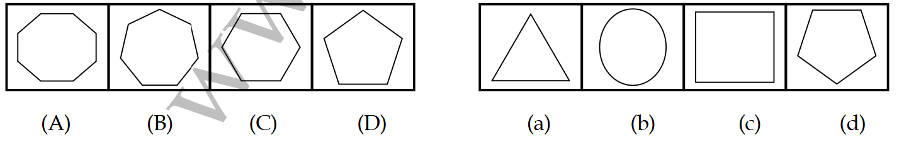
- (A) 
- (B) 
- (C) 
- (D) 
**Answer:** D
**Explanation:** Pattern continues with next transformation.

#### Q26. Find out the next figure
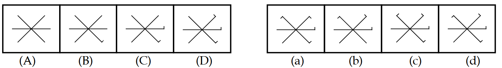
- (A) 
- (B) 
- (C) 
- (D) 
**Answer:** D
**Explanation:** Consistent pattern in lines.

#### Q27. Find the odd figure.
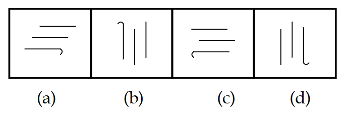
- (A) 
- (B) 
- (C) 
- (D) 
**Answer:** A
**Explanation:** Others can be rotated into each other.

#### Q28. Find the odd figure.
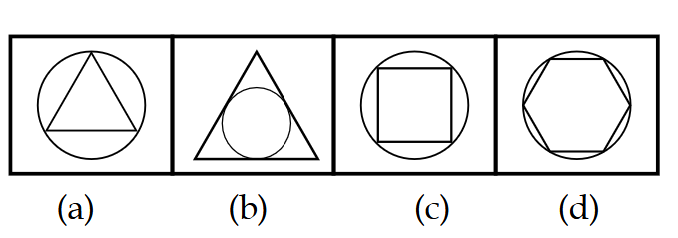
- (A) 
- (B) 
- (C) 
- (D) 
**Answer:** B
**Explanation:** In others, element enclosed inside circle.

#### Q29. How many triangles are there puzzles.
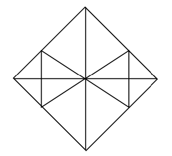
- (A) 16
- (B) 22
- (C) 28
- (D) 32
**Answer:** C
**Explanation:** Total 28 triangles.

#### Q30. How many maximum squares are in the following figure?
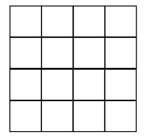
- (A) 32
- (B) 30
- (C) 29
- (D) 28
**Answer:** B
**Explanation:** Total 30 squares.

#### Q31. If in a certain code, GLAMOUR is written as IJC NMWP and MISRULE is written as OGUSSNC, then how will TOPICAL be written in that code?
- (A) VMRJECN
- (B) VMRHACJ
- (C) VMRJACJ
- (D) VNRJABJ
**Answer:** C
**Explanation:** Specific shift pattern.

#### Q32. If DELHI can be coded as CCIDD, how would you code BOMBAY?
- (A) AJMTVT
- (B) AMJXVS
- (C) MJXVSU
- (D) WXYZAX
**Answer:** B
**Explanation:** Backward shifts increasing.

#### Q33. If 'eraser' is called 'box', 'box' is called 'pencil', 'pencil' is called 'sharpener' and 'sharpener' is called "bag", what will a child write with?
- (A) Eraser
- (B) Box
- (C) Pencil
- (D) Sharpener
**Answer:** D
**Explanation:** Pencil called sharpener.

#### Q34. If 'pen' is 'table', 'table' is 'fan', 'fan' is 'chair' and 'chair' is 'roof, on which of the following will a person sit?
- (A) Fan
- (B) Chair
- (C) Roof
- (D) Table
**Answer:** C
**Explanation:** Chair called roof.

#### Q35. Looking at a portrait of a man, Harsh said, "His mother is the wife of my father's son. Brothers and sisters I have none." At whose portrait was Harsh looking?
- (A) His son
- (B) His cousin
- (C) His uncle
- (D) His nephew
**Answer:** A
**Explanation:** Harsh's son.

#### Q36. Introducing a man to her husband, a woman said, "His brother's father is the only son of my grandfather." How is the woman related to this man?
- (A) Mother
- (B) Aunt
- (C) Sister
- (D) Daughter
**Answer:** C
**Explanation:** Sister.

#### Q37. In a March Past, seven persons are standing in a row. Q is standing left to R but right to P. O is standing right to N and left to P. Similarly, S is standing right to R and left to T. Find out who is standing in the middle.
- (A) P
- (B) Q
- (C) R
- (D) 
**Answer:** B
**Explanation:** Q is in the middle.

#### Q38. Garima is taller than Sarita but not taller than Reena. Reena and Tanya are of the same height. Garima is shorter than Anu. Amongst all the girls, who is/are the shortest?
- (A) Anu
- (B) Reena and Tanya
- (C) Garima
- (D) Sarita
**Answer:** D
**Explanation:** Sarita is shortest.

#### Q39. A person starts from a point A and travels 3 km eastwards to B and then turns left and travels thrice that distance to reach C. He again turns left and travels five times the distance he covered between A and B and reaches his destination D. The shortest distance between the starting point and the
- (A) 12 km
- (B) 15 km
- (C) 16 km
- (D) 18 km
**Answer:** B
**Explanation:** Shortest distance AD = 15 km.

#### Q40. Pratap starts from school and walks 7 km towards East. He takes a left and walks 4 km, then takes a right and walks 2 km, again takes a right and walks 3 km. Which direction is he facing now?
- (A) South
- (B) North
- (C) East
- (D) West
**Answer:** A
**Explanation:** Facing South.

### Section: General Knowledge
#### Q41. Horse latitudes lie within the atmospheric pressure belts of
- (A) Polar high
- (B) Equatorial low
- (C) Sub-tropical high
- (D) Sub-polar low
**Answer:** C
**Explanation:** Sub-tropical high pressure belts.

#### Q42. According to the Election Commission of India, in order to be recognized as a 'National Party', a political party must be treated as a recognized political party in how many States?
- (A) At least two States
- (B) At least three States
- (C) At least four States
- (D) At least five States
**Answer:** C
**Explanation:** At least four States.

#### Q43. The National Commission for Women was
- (A) an amendment in the Constitution of India
- (B) a decision of the Union Cabinet
- (C) an Act passed by the Parliament
- (D) an order of the President of India
**Answer:** C
**Explanation:** Act passed by Parliament.

#### Q44. A writ issued to secure the release of a person detained illegally is found to be
- (A) Mandamus
- (B) Habeas corpus
- (C) Certiorari
- (D) Prohibition
**Answer:** B
**Explanation:** Habeas corpus.

#### Q45. A Money Bill passed by the Lok Sabha can be held up by the Rajya Sabha for how many weeks?
- (A) Two
- (B) Three
- (C) Four
- (D) Five
**Answer:** A
**Explanation:** Two weeks.

#### Q46. Which allotropy of carbon is in rigid three-dimensional structure?
- (A) Graphite
- (B) Fullerene
- (C) Diamond
- (D) Carbon black
**Answer:** C
**Explanation:** Diamond.

#### Q47. What is the role of positive catalyst in a chemical reaction?
- (A) It increases the rate of reaction
- (B) It decreases the rate of reaction
- (C) It increases the yield of the products
- (D) It provides better purity of the products
**Answer:** C
**Explanation:** Increases yield.

#### Q48. Iodised salt is a
- (A) mixture of potassium iodide and common salt
- (B) mixture of molecular iodide and common salt
- (C) compound formed by combination of potassium iodide and common salt
- (D) compound formed by molecular iodine and common salt
**Answer:** C
**Explanation:** Compound of potassium iodide and salt.

#### Q49. The living content of cell is called protoplasm. It is composed of:
- (A) Cytoplasm only
- (B) Cytoplasm and nucleoplasm
- (C) Nucleoplasm only
- (D) Cytoplasm, nucleoplasm and other organelles
**Answer:** D
**Explanation:** All components.

#### Q50. Penicillin inhibits synthesis of bacterial
- (A) cell wall
- (B) protein
- (C) RNA
- (D) DNA
**Answer:** B
**Explanation:** Protein synthesis.

#### Q51. The Fundamental Rights guaranteed in the Constitution India can be suspended only by
- (A) a proclamation of National Emergency
- (B) an Act passed by the Parliament
- (C) an amendment to the Constitution of India
- (D) the judicial decisions of the Supreme Court
**Answer:** A
**Explanation:** National Emergency.

#### Q52. Which one of the following Schedules of the Constitution of India has fixed the number of Members of the Rajya Sabha to be elected from each State?
- (A) Fifth Schedule
- (B) Third Schedule
- (C) Sixth Schedule
- (D) Fourth Schedule
**Answer:** D
**Explanation:** Fourth Schedule.

#### Q53. Which one of the following constitutional authorities inquires and decides in case of doubts and disputes arising out of election of the President and Vice President of India
- (A) The Supreme Court of India
- (B) The Election Commission of India
- (C) The Parliamentary Committee
- (D) The High Court of Delhi
**Answer:** A
**Explanation:** Supreme Court.

#### Q54. Devaluation of currency will be more beneficial if prices of
- (A) domestic goods remain constant
- (B) exports become cheaper to importers
- (C) imports remain constant
- (D) exports rise proportionately
**Answer:** A
**Explanation:** Domestic goods constant.

#### Q55. Which of the following with regard to the term 'bank run' is correct?
- (A) The net balance of money a bank has in its chest at the end of the day's business
- (B) The ratio of bank's total deposits and total liabilities
- (C) A panic situation when the deposit holders start withdrawing cash from the banks
- (D) The period in which a bank creates highest credit in the market
**Answer:** C
**Explanation:** Panic withdrawal.

#### Q56. The headquarters of 'Economic and Social Commission for Asia and the Pacific' is located at
- (A) Singapore
- (B) Manila
- (C) Bangkok
- (D) Hong Kong
**Answer:** C
**Explanation:** Bangkok.

#### Q57. The College of Military Engineering affiliated to Jawaharlal Nehru University is situated at
- (A) New Delhi
- (B) Dehradun
- (C) Nainital
- (D) Pune
**Answer:** D
**Explanation:** Pune.

#### Q58. Which one of the following is the motto of NCC?
- (A) Unity and Discipline
- (B) Unity and Integrity
- (C) unity and command
- (D) unity and service
**Answer:** A
**Explanation:** Unity and Discipline.

#### Q59. 'Prahaar' is
- (A) a battle tank
- (B) a surface-to-surface missile
- (C) an aircraft carrier
- (D) a submarine
**Answer:** B
**Explanation:** Surface-to-surface missile.

#### Q60. Triples' is a new format of
- (A) Boxing
- (B) Judo
- (C) Chess
- (D) Badminton
**Answer:** D
**Explanation:** Badminton.

#### Q61. Which country is to play host to the Asian Football Confederation (AFC) Women's Asian Cup 2022?
- (A) UK
- (B) India
- (C) Sri Lanka
- (D) Bangladesh
**Answer:** B
**Explanation:** India.

#### Q62. Where are the headquarters of International Paralympic Committee?
- (A) Germany
- (B) Bulgaria
- (C) Spain
- (D) England
**Answer:** A
**Explanation:** Germany.

#### Q63. Which country is to play host to the Asian Football Confederation (AFC) Women's Asian Cup 2022?
- (A) UK
- (B) India
- (C) Sri Lanka
- (D) Bangladesh
**Answer:** B
**Explanation:** India.

#### Q64. The 'Panchsheel Agreement' for peaceful coexistence was signed between
- (A) India and Bhutan
- (B) India and Nepal
- (C) India and China
- (D) India and Pakistan
**Answer:** C
**Explanation:** India and China.

#### Q65. Rand/ZAR' is the currency of
- (A) Burundi
- (B) Libya
- (C) Sudan
- (D) South Africa
**Answer:** D
**Explanation:** South Africa.

#### Q66. Who has been appointed as the Chief Election Commissioner in April 2021?
- (A) Sushil Chandra
- (B) Prasanna Chandra
- (C) Ajay Kumar Bhalla
- (D) Injeti Srinivas
**Answer:** A
**Explanation:** Sushil Chandra.

#### Q67. In which state is the India's largest floating solar power plant is proposed to be set up?
- (A) Maharashtra
- (B) Madhya Pradesh
- (C) Telangana
- (D) Tamil Nadu
**Answer:** C
**Explanation:** Telangana.

#### Q68. Vaishali S Hiwas, has been appointed as the first woman officer of which Central Armed Police Force?
- (A) BRO
- (B) ITBP
- (C) CAPF
- (D) CRPF
**Answer:** A
**Explanation:** BRO.

#### Q69. Which institution has proposed that India should provide additional incentives on purchase of EVs, in addition to that provided FAME-II?
- (A) Niti Aayog
- (B) GST Council
- (C) Finance Commission
- (D) Society of Automobile Manufacturers
**Answer:** A
**Explanation:** Niti Aayog.

#### Q70. Which Indian IT major has recently obtained Google Cloud Partner status?
- (A) HCL
- (B) Wipro
- (C) Infosys
- (D) TCS
**Answer:** C
**Explanation:** Infosys.

### Section: English
#### Q71. The question is (a)/ so complicated that (b)/ it could not be solved (c)/ immediately. (d)/ No error (e)/
- (A) (a)
- (B) (b)
- (C) (c)
- (D) (d)
**Answer:** C
**Explanation:** Tense mismatch; should be "cannot be solved".

#### Q72. Unless he does not discipline (a)/ himself and tries hard (b)/ he will not learn (c)/ anything.(d)/ No error (e)/
- (A) (a)
- (B) (b)
- (C) (c)
- (D) (d)
**Answer:** D
**Explanation:** Double negative issue.

#### Q73. Despite of having (a)/ an exceptionally bright career record (b)/ she could not get (c)/ whatever she deserved. (d)/ No error (e)/
- (A) (a)
- (B) (b)
- (C) (c)
- (D) (d)
**Answer:** A
**Explanation:** "Despite" does not take "of".

#### Q74. Now the time was to (a)/ escape and he opened the window (b)/ and jumped out. (c)/ No error (d)/
- (A) (a)
- (B) (b)
- (C) (c)
- (D) (d)
**Answer:** A
**Explanation:** "Now was the time to".

#### Q75. The officer is angry on the clerk (a)/ for not completing the job (b)/ on time. (c)/ No error (d)/
- (A) (a)
- (B) (b)
- (C) (c)
- (D) (d)
**Answer:** A
**Explanation:** "Angry with".

#### Q76. Everyone who was injured (a)/ in the accident (b)/ were taken to the hospital (c)/ No error (d)/
- (A) (a)
- (B) (b)
- (C) (c)
- (D) (d)
**Answer:** C
**Explanation:** "Was taken" (singular subject).

#### Q77. Ram is very calculative and always has an axe to grind.
- (A) has no result
- (B) works for both sides
- (C) has a private agenda
- (D) fails to arouse interest
**Answer:** C
**Explanation:** Private motive.

#### Q78. The police looked all over for him but drew a blank.
- (A) did not find him
- (B) put him in prison
- (C) arrested him
- (D) took him to court
**Answer:** A
**Explanation:** Found nothing.

#### Q79. On the issue of marriage, Sarita put her foot down.
- (A) stood up
- (B) was firm
- (C) got down
- (D) walked fast
**Answer:** B
**Explanation:** Refused to yield.

#### Q80. His investments helped him make a killing in the stock market.
- (A) lose money quickly
- (B) plan a murder quickly
- (C) murder someone quickly
- (D) make money quickly
**Answer:** D
**Explanation:** Large profit.

#### Q81. He is on the wrong side of seventy.
- (A) more than seventy years old
- (B) less than seventy years old
- (C) seventy years old
- (D) eighty years old
**Answer:** A
**Explanation:** Over seventy.

#### Q82. She didn't realize that the clever salesman was taking her for a ride
- (A) forcing her to go with him
- (B) trying to trick her
- (C) taking her in a car
- (D) pulling her along
**Answer:** B
**Explanation:** Deceiving her.

#### Q83. Extreme old age when a man behaves like a fool
- (A) Imbecility
- (B) Senility
- (C) Dotage
- (D) Superannuation
**Answer:** C
**Explanation:** Dotage.

#### Q84. That which cannot be corrected
- (A) Unintelligible
- (B) Indelible
- (C) Illegible
- (D) Incorrigible
**Answer:** D
**Explanation:** Incorrigible.

#### Q85. The study of ancient societies
- (A) Anthropology
- (B) Archaeology
- (C) History
- (D) Ethnology
**Answer:** B
**Explanation:** Archaeology.

#### Q86. S1: A force of exists between everybody in the universe. ... S6: ... We can call this force of attraction gravity. The Proper sequence should be:
- (A) PRQS
- (B) PRSQ
- (C) QSRP
- (D) QSPR
**Answer:** D
**Explanation:** QSPR.

#### Q87. S1: Calcutta unlike other cities kepts its trams. ... The Proper sequence should be:
- (A) PRSQ
- (B) PSQR
- (C) SQRP
- (D) RPSQ
**Answer:** D
**Explanation:** RPSQ.

#### Q88. S1: For some time in his youth Abraham Lincoln was manager for a shop. ... The Proper sequence should be:
- (A) SRQP
- (B) QSPR
- (C) SQRP
- (D) QPSR
**Answer:** B
**Explanation:** QSPR.

#### Q89. S1: All the land was covered by the ocean. ... The Proper sequence should be:
- (A) PQRS
- (B) PQSR
- (C) QPSR
- (D) QPRS
**Answer:** D
**Explanation:** QPRS.

#### Q90. John had told me that he hasn't done it yet.
- (A) told
- (B) tells
- (C) was telling
- (D) No improvement
**Answer:** B
**Explanation:** Tells (present).

#### Q91. If he had time he will call you.
- (A) would have
- (B) would have had
- (C) has
- (D) No improvement
**Answer:** C
**Explanation:** Has.

#### Q92. Will you lend me few rupees in this hour of need?
- (A) lend me any rupees
- (B) borrow me a few rupees
- (C) lend me a few rupees
- (D) No improvement
**Answer:** C
**Explanation:** "A few rupees".

#### Q93. During his long discourse, he did not touch that point.
- (A) touch upon
- (B) touch on
- (C) touch of
- (D) No improvement
**Answer:** B
**Explanation:** Touch on.

#### Q94. He found a wooden broken chair in the room.
- (A) wooden and broken chair
- (B) broken wooden chair
- (C) broken and wooden chair
- (D) No improvement
**Answer:** B
**Explanation:** Adjective order: broken wooden.

#### Q95. Women like men to flatter them.
- (A) Men are liked by women to flatter them.
- (B) Women like to be flattered by men.
- (C) Women like that men should flatter them.
- (D) Women are liked to be flattered by men.
**Answer:** B
**Explanation:** Passive: to be flattered.

#### Q96. It is your duty to make tea at eleven O'clock.
- (A) You are asked to make tea at eleven O' clock.
- (B) You are required to make tea at eleven O'clock.
- (C) You are supposed to make tea at eleven O' clock.
- (D) Tea is to be made by you at eleven O' clock.
**Answer:** C
**Explanation:** Supposed to.

#### Q97. Look at the poll results, do they inspire hope ?
- (A) Let the poll results be looked. is hope inspired by them ?
- (B) Let the poll results be looked at. has hope been inspired by them ?
- (C) Let the poll results be looked at. is hope being inspired by them ?
- (D) Let the poll results be looked at. is hope inspired by them ?
**Answer:** D
**Explanation:** Correct passive.

#### Q98. All religions are to advance the cause of peace (P)/ in a holy partnership (Q)/ justice and freedom (R)/ bound together (S)
- (A) P R Q S
- (B) P Q R S
- (C) S Q P R
- (D) S P Q R
**Answer:** C
**Explanation:** S Q P R.

#### Q99. Seventy-two people reports PTI (P)/ were affected by food poisoning (Q)/ including several women and children (R)/ of the central part of the city (S)/
- (A) S P Q R
- (B) P Q R S
- (C) R S P Q
- (D) R S Q P
**Answer:** D
**Explanation:** R S Q P.

#### Q100. The Prime Minister declared that those states (P)/ will get all help and aid (Q)/ where family planning (R)/ is effected very efficiently (S)/
- (A) P R S Q
- (B) P Q R S
- (C) R S P Q
- (D) Q P S R
**Answer:** A
**Explanation:** P R S Q.
